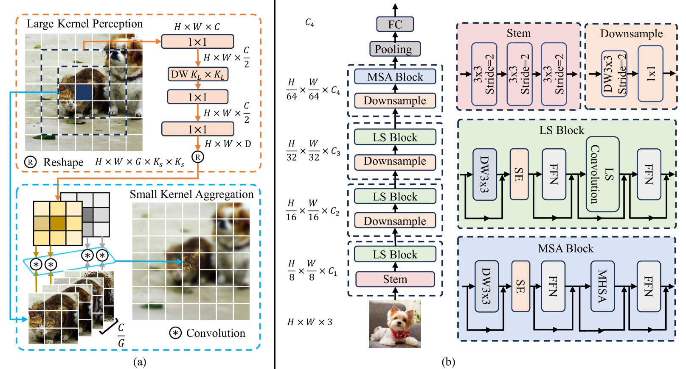

### *LSNet: See Large, Focus Small*

**-- Ao Wang, Zijia Lin etc. Tsinghua University / CVPR2025**

针对当前的轻量级视觉网络，自注意力和卷积在处理感知和聚合过程时存在的效率与性能权衡问题，提出一种名为 LSNet 的新型轻量级模型家族。核心创新点主要是两个部分：

1. **“见大，聚小”（See Large, Focus Small）策略**：该设计灵感来源于人类视觉系统 。人类的周边视觉（peripheral vision）能够感知广阔的视野（“见大”），而中央凹视觉（foveal vision）则能精确地聚焦于细节（“聚小”）。LSNet 旨在模拟这种机制，通过大范围感知和高精度聚合来高效处理视觉信息 。
2. **LS（Large-Small）卷积**：为了实现上述策略，作者提出了一种新型的 LS 卷积操作 。它包含两个主要步骤：
   - **大核感知（Large-Kernel Perception, LKP）**：使用大核静态卷积（depth-wise convolution）来高效地捕捉大范围的空间上下文信息，类似于周边视觉的“见大”能力 。
   - **小核聚合（Small-Kernel Aggregation, SKA）**：利用动态卷积（dynamic convolution）以自适应的方式在小范围内聚合特征，实现对局部细节的精确处理，类似于中央凹视觉的“聚小”能力 。

与传统的自注意力（全范围感知和聚合）和普通卷积（小范围感知和聚合）相比，LS 卷积通过感知与聚合在不同尺度上操作，有效地解决了它们的局限性 。

#### 整体架构

整体架构如图所示，图a为提出的 LS 卷积模块，右侧为提出的 LSNet。

LSNet 的基础构建单元是 **LS（Large-Small）块**。它是一种新颖的特征提取模块，核心思想是将大范围感知和局部聚合分开处理。一个完整的 LS 块主要由以下几部分组成：

1. **输入和归一化**：块的输入特征首先通过 LayerNorm 进行归一化。

2. **大核感知（Large-Kernel Perception, LKP）**：

   这是见大的核心部分，它通过一个大核深度可分离卷积来实现。卷积核的大小通常设置为较大的值，例如$7\times7$。这种设计允许模型在不显著增加计算量的情况下，捕获更大的感受野，从而获取丰富的上下文信息。为了进一步增强模型的表达能力，LKP模块中还嵌入了一个 Squeeze-and-Excitation（SE）层，以实现通道维度的注意力，自适应地调整不同通道的重要性。

3. **小核聚合（Small-Kernel Aggregation, SKA）**：

   这是聚小的核心部分，它通过一个小核动态卷积来实现，卷积核的大小较小，通常为$3\times3$。

与静态卷积不同，动态卷积的卷积核权重是根据输入特征自适应生成的。这种机制使得模型能够根据不同的输入内容，动态地调整局部特征的聚合方式，从而实现更精细、更灵活的特征处理。

LKP 和 SKA 的输出特征被加权求和或拼接（论文中提到的是先通过一个 1×1 卷积进行融合）后，再通过一个 MLP（多层感知机）进行通道维度的信息混合。整个 LS 块还采用了**残差连接（residual connection）**，将块的输入与输出相加，这有助于模型的深层训练和梯度流动。

LSNet 的整体网络结构采用了一种多阶段的金字塔式设计，类似于许多现代的 CNN 和 Transformer 模型，逐步下采样并增加通道数。它包含四个阶段（stage），每个阶段负责处理不同尺度的特征。

**阶段 1-3**：

- 这三个阶段主要由上述的 **LS 块**组成。
- 每个阶段的开始处都包含一个 **Patch Embedding** 模块，通过一个步长为 2 的卷积层来实现下采样，同时增加特征图的通道数。
- 这种设计使得网络能够在较低的计算成本下，逐步学习从局部到全局的特征表示。

**阶段 4**：

- 这是分辨率最小、通道数最多的阶段。
- 为了更好地捕捉长距离依赖关系，尤其是在高语义层次上，作者在这里引入了 **多头自注意力（Multi-Head Self-Attention, MSA）块**。
- MSA 模块能够对整个特征图上的所有位置进行交互，获取全局信息。
- 这种**卷积-注意力混合**的设计，在早期的阶段利用卷积的局部归纳偏置来高效处理低级特征，在后期的阶段则利用自注意力机制来捕捉全局依赖，是一种非常有效的网络设计策略。

总的来说，LSNet 的模型结构是一种将卷积的局部性和高效性与动态卷积的适应性、以及自注意力的全局性有机结合的创新范式。它通过精心设计的 LS 块在不同阶段扮演不同角色，实现了“见大，聚小”的核心理念，从而在轻量级模型中达到了性能和效率的卓越平衡。