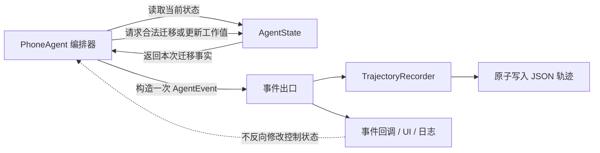

# 把控制权留给状态，把历史交给事件

> 以 PhoneAgent 的 `state.py` 与 `events.py` 为例，理解“内部状态驱动控制流，事件流驱动观察与持久化”

在 Agent 系统中，我们经常同时面对两类问题：

1. **下一步应该做什么？**
2. **刚才到底发生了什么？**

这两个问题看起来相近，实际上属于两种完全不同的职责。

“下一步应该做什么”需要一个可靠、唯一、可校验的当前状态；“刚才发生了什么”需要一条按时间排列、可供 UI、日志、调试和持久化消费的事实流。如果把二者塞进同一个对象，状态很快会变成不断膨胀的历史仓库；如果让事件反过来决定主流程，运行时又会被回调、日志系统和持久化细节绑架。

PhoneAgent 采用的思路可以概括为一句话：

> **内部状态驱动控制流，事件流驱动观察与持久化。**

它不是某个框架专属的技巧，而是一种适合长流程 Agent、工作流引擎、机器人控制器和自动化任务系统的通用架构模式。

## 一、先把“状态”和“事件”分开

在 PhoneAgent 中，`AgentState` 与 `AgentEvent` 分别回答两个问题。

`AgentState` 回答：

- 当前任务目标是什么？
- Agent 正处于观察、规划、执行、验证还是恢复阶段？
- 当前是第几步？
- 最近一次观察、动作、验证和恢复结果是什么？
- 连续失败、重复动作和恢复预算是否已经触发控制条件？
- 任务是否已经结束？

`AgentEvent` 回答：

- 什么时候发生了什么？
- 发生在第几步？
- 当时携带了哪些审计信息？
- UI、日志、测试或轨迹文件应该看到什么？

二者的关键差异不是“一个可变、一个不可变”，而是**用途不同**：

| 维度 | `AgentState` | `AgentEvent` |
| --- | --- | --- |
| 时间视角 | 当前 | 过去某一时刻 |
| 主要用途 | 决定控制流 | 观察、审计、持久化 |
| 数据形态 | 最新工作快照 | 追加式事实记录 |
| 读取者 | Agent 编排器 | trajectory、UI、回调、测试 |
| 是否反向控制主流程 | 是 | 否 |

这条边界非常重要：**事件可以描述状态变化，但不能成为另一套实时状态。**

## 二、整体结构：一条控制链，一条观察链

PhoneAgent 的核心关系可以画成下面这样：



这里有两条方向明确的链路：

- **控制链**：`PhoneAgent → AgentState → 下一步行为`；
- **观察链**：`PhoneAgent → AgentEvent → trajectory / callback`。

它们在 `PhoneAgent` 的编排点相交，但没有形成双向依赖。状态更新成功以后，编排器才发布对应事件；事件消费者即使失败，也不应改变已经发生的状态迁移。

## 三、`state.py`：用有限状态机守住控制权

PhoneAgent 将一次任务划分为这些阶段：

```text
idle
→ initializing
→ observing
→ planning
→ executing
→ verifying / recovering / waiting_user
→ completed / failed / cancelled
```

阶段枚举只是第一步。真正让它成为有限状态机的是 `_ALLOWED_TRANSITIONS`：每个阶段都明确列出允许到达的下一个阶段。

例如，`PLANNING` 可以进入 `EXECUTING`、`RECOVERING` 或终态，却不能直接跳回 `IDLE`；`COMPLETED`、`FAILED`、`CANCELLED` 是终态，不允许继续迁移。人工确认期间进入 `WAITING_USER`，确认通过后再回到 `EXECUTING`，而不是在“看起来仍在执行”的假状态中阻塞。

这种白名单式迁移比散落在业务代码中的 `if phase == ...` 更可靠，因为它把整个生命周期的合法边界集中在一个地方：

```python
if target not in _ALLOWED_TRANSITIONS[self.phase]:
    raise StateTransitionError(
        f"Illegal PhoneAgent transition: {self.phase.value} -> {target.value}"
    )
```

它带来三个直接收益。

### 1. 非法路径尽早失败

如果代码试图从 `INITIALIZING` 直接进入 `EXECUTING`，错误会在状态边界暴露，而不是等到设备已经执行动作后才发现上下文不完整。

### 2. 终态具有真正的终止语义

终态不是一个供 UI 展示的字符串，而是控制流不可继续的约束。重新开始任务必须显式调用 `start()` 或 `reset()`，不能偷偷复用上一轮残留状态。

### 3. 所有运行入口共享同一套事实

无论调用 `run_async()` 还是 `step_async()`，都读取同一个 `AgentState`。最大步数、取消、恢复和终态不应在两个入口中形成两套互相漂移的生命周期。

## 四、状态只保存“做决定需要的最新事实”

有限状态机解决的是阶段迁移，但 Agent 的控制决策还需要一些工作值，例如：

- `current_step`：当前步骤；
- `last_observation`：最近一次可信观察；
- `repeated_action_count`：重复动作次数；
- `stagnant_observation_count`：画面停滞次数；
- `consecutive_failures`：连续失败次数；
- `hard_recovery_count` 与 `soft_replan_count`：不同性质的恢复预算；
- `last_execution`：最近一次执行、验证和恢复的聚合结果。

这些字段有一个共同特点：它们都会影响下一次控制决策。

相反，所有历史模型响应、每次截图、每次指标变化都没有必要永久堆在 `AgentState` 中。状态对象只保留最新值，而完整历史进入 trajectory 事件流。这样可以避免两种常见问题：

- 状态对象随着任务执行无限增长；
- “状态中的历史”和“日志中的历史”出现两份不一致的真相。

PhoneAgent 的原则是：

> `AgentState` 是唯一实时状态；trajectory 是唯一审计历史。

## 五、`events.py`：把运行事实变成统一的数据契约

`AgentEvent` 的结构很小：

```python
@dataclass(slots=True)
class AgentEvent:
    type: EventType
    message: str = ""
    payload: dict[str, Any] = field(default_factory=dict)
    step: int | None = None
    timestamp: float = field(default_factory=time.time)
```

但它提供了一项非常重要的能力：**让所有观察者使用同一种运行事实格式。**

事件类型覆盖了任务启动、阶段迁移、观察、上下文构造、模型请求与响应、动作、执行、验证、恢复、错误、指标和任务结束。UI 不需要解析控制器内部对象，轨迹文件也不需要重新拼装另一套日志结构。

统一事件契约还避免了一个隐蔽问题：如果“回调通知”和“持久化记录”分别创建事件，它们可能拥有不同时间戳、不同 payload，甚至不同错误码。PhoneAgent 的做法是创建一次事件，然后让同一事实进入两个出口：

```python
event = AgentEvent(...)
self.trajectory.add_event(event)
self._emit(event)
```

轨迹先保存事件快照，再调用外部观察者。配合输入 payload 的防御性复制，回调即使修改自己收到的数据，也不能反向篡改 Agent 的控制状态或已经进入轨迹的事实。

这里的“不变”更准确地说是 **immutable-in-practice**：它依赖清晰的所有权、复制边界和只观察约定，而不是宣称 Python 对象在语言层面完全不可变。如果系统未来接入不受信任的插件，可以进一步使用 `frozen=True`、只读映射或更严格的事件序列化边界。

## 六、状态迁移如何自然变成事件

这个模式最漂亮的地方，是状态机不需要自己认识日志系统。

`AgentState.transition()` 只负责两件事：

1. 验证迁移是否合法；
2. 更新当前阶段，并返回本次迁移的事实。

返回值大致如下：

```python
{
    "previous": "executing",
    "current": "waiting_user",
    "reason": "Wait for action confirmation",
    "metadata": {"wait_reason": "action_confirmation"},
}
```

随后由 `PhoneAgent` 把它包装成 `PHASE_CHANGE` 事件：

```python
transition = self.state.transition(target, reason=reason, metadata=metadata)
self._record_phase_transition(transition)
```

这种设计比让 `AgentState` 直接写日志更干净。状态模块不知道 trajectory 存在哪里，也不知道有没有 Web UI；事件模块同样不知道哪些迁移合法。编排器负责把二者连接起来。

职责可以总结为：

- `AgentState`：**是否允许发生？发生后当前状态是什么？**
- `AgentEvent`：**这件事如何被外部看见？**
- `PhoneAgent`：**何时发起变化，并把变化发布出去？**
- `TrajectoryRecorder`：**如何可靠保存已经发布的事实？**

## 七、为什么这不是 Event Sourcing

看到追加式事件流，很容易把这种设计称为 Event Sourcing，但两者并不相同。

Event Sourcing 通常把事件日志作为业务状态的权威来源，当前状态可以通过重放事件重建。而 PhoneAgent 的运行时控制直接依赖 `AgentState`；trajectory 的主要职责是观察、审计、调试和持久化结果，并不要求系统启动时重放全部事件才能继续执行。

因此，它更接近：

> **状态机 + 领域事件 + 追加式运行轨迹。**

这个选择很适合设备 Agent。设备屏幕是外部世界的实时事实，旧事件无法完整重建手机此刻的真实画面。与其假装可以仅靠事件重放恢复一切，不如明确承认：恢复控制需要重新观察设备，历史事件则负责解释此前发生了什么。

## 八、一个完整例子：敏感动作等待确认

假设模型规划了一个需要用户确认的动作，流程可以拆成：

1. 当前状态从 `PLANNING` 进入 `EXECUTING`；
2. 风险策略判断该动作需要确认；
3. 状态从 `EXECUTING` 进入 `WAITING_USER`；
4. 发布一条 `PHASE_CHANGE` 事件，UI 因此展示等待状态；
5. 用户确认后，状态回到 `EXECUTING`；
6. 发布新的 `PHASE_CHANGE` 事件；
7. 动作真正派发后发布 `EXECUTION`；
8. 进入 `VERIFYING` 并发布验证结果；
9. 根据结果进入 `OBSERVING`、`RECOVERING` 或终态。

关键点在于：UI 展示“等待用户”是事件流的消费结果，但 Agent 是否允许继续执行，仍由内部状态决定。即使没有 UI、回调断开或轨迹保存失败，核心控制边界也不会因此消失。

反过来，外部观察者也不需要不断轮询整个 `AgentState` 并猜测发生了什么。它可以从事件中直接知道迁移原因、步骤和相关元数据。

## 九、这种模式解决了哪些工程风险

### 风险一：UI 状态和运行时状态分叉

如果 Web 层自己维护 `running`、`waiting_user`、`failed`，核心运行时又维护另一套阶段，两者迟早会出现竞争。正确做法是让 UI 消费事件并展示，生命周期所有权仍留在核心状态机。

### 风险二：日志代码侵入控制逻辑

如果每个业务分支都直接写文件、更新数据库或调用 UI，测试会变得困难，异常边界也会混乱。统一 `_record_event()` 后，业务代码只表达“发生了什么”。

### 风险三：回调异常破坏任务

观察者属于外围能力。事件回调应该被隔离：回调失败可以记录日志，但不应该让已经合法完成的状态迁移回滚或让设备动作重复执行。

### 风险四：历史数据反向污染实时状态

把全部事件塞回状态对象，会让状态越来越重，也容易让旧数据参与当前决策。实时状态只保留有控制意义的聚合值，历史细节留在 trajectory。

### 风险五：只有日志，没有可证明的生命周期

日志能告诉我们代码走过某些分支，却不能阻止非法分支。有限状态机负责约束，事件负责证明；二者缺一不可。

## 十、实现时应坚持的五条规则

### 1. 只有一个状态所有者

设备适配器、模型客户端、验证器、恢复策略和 UI 都不能私自维护第二套 Agent 生命周期。

### 2. 先改变状态，再发布事实

只有合法迁移成功以后，才发布阶段变化事件。不要先告诉外部“已经执行”，再发现内部迁移失败。

### 3. 事件消费者不得成为隐式控制器

回调可以展示、统计、保存和告警，但不能依靠修改事件 payload 来改变主流程。如果确实需要外部输入，应通过显式命令接口，例如 `request_cancel()` 或用户确认接口。

### 4. 快照与历史采用不同的数据密度

状态保存最新、紧凑、决策相关的数据；事件保存可解释、可检索、带时间和步骤的事实。

### 5. 终态和持久化必须可审计

任务结束时应先写入 `COMPLETED`、`FAILED` 或 `CANCELLED`，再记录统一 `FINISH` 事件，并用原子替换保存轨迹，避免得到半写入文件。

## 十一、什么时候适合使用

这种模式尤其适合以下系统：

- 有明确生命周期的 Agent 或工作流；
- 需要暂停、恢复、取消和人工接管的长任务；
- 同时需要 CLI、Web UI、日志和离线分析；
- 控制正确性比“方便打印日志”更重要；
- 外部世界无法仅通过历史事件完整重建，例如手机、机器人和浏览器自动化。

对于只有两三个无状态函数调用的小脚本，这套结构可能显得偏重；但一旦系统出现异步取消、失败恢复、人工确认和多种观察端，它会迅速显示价值。

## 十二、结语

一个可靠的 Agent 运行时，需要同时拥有“现在”和“过去”，但不能让它们争夺控制权。

`AgentState` 保存现在：它紧凑、唯一，并通过有限状态机决定下一步是否合法。

`AgentEvent` 描述过去：它统一、可追加，为回调、UI、测试和 trajectory 提供同一种事实。

`PhoneAgent` 作为编排器，把一次合法状态变化转化为一次可观察事件，却不允许事件消费者反向成为第二个控制器。

这就是“内部状态驱动控制流，事件流驱动观察与持久化”的核心：

> **状态负责做决定，事件负责讲清楚；状态守住运行时，事件留下可验证的历史。**
