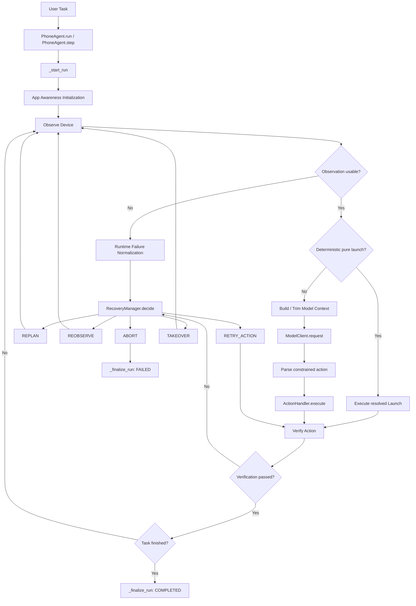
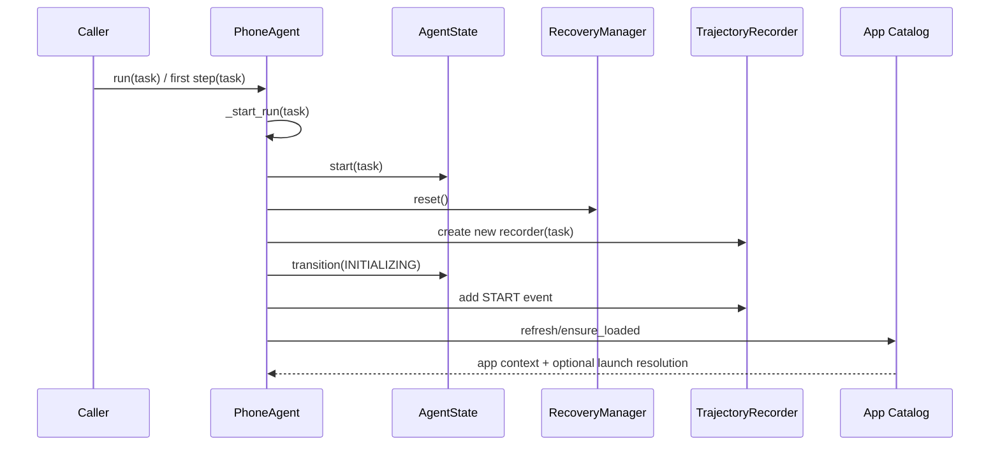
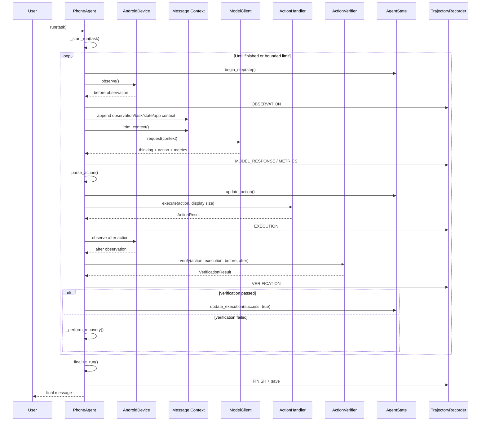
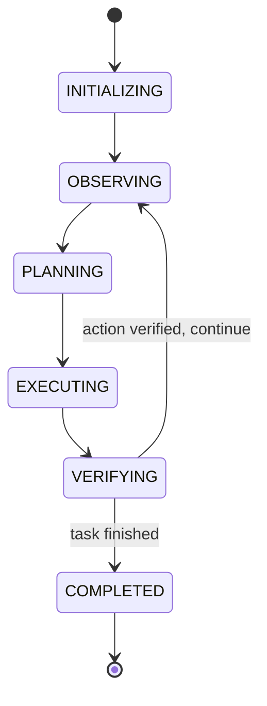
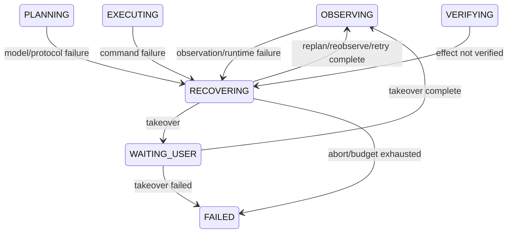

# PhoneAgent Agent Loop 技术设计与代码导读

> 文档类型：实现导向的运行时架构说明（Implementation-Oriented Runtime Architecture Document）
> 适用代码：`src/phoneagent/agent.py` 中的 `PhoneAgent` Runtime 
> 文档目的：在阅读本文后，能够沿着代码准确定位一次任务从进入、执行、验证、恢复到结束的完整路径，并理解每个核心对象与函数的职责边界。

---

## 1. 文档定位

本文重点回答以下问题：

- 一个任务如何进入 Runtime？
- 一次 Agent Step 到底包含哪些阶段？
- 观察、模型规划、动作执行和验证如何连接？
- 为什么“ADB 命令成功”不等于“Agent Step 成功”？
- 失败以后由谁决定重试、重新观察、重新规划或终止？
- 模型上下文、屏幕观察、状态机和轨迹记录如何在循环中更新？
- `run()` 与 `step()` 的语义有什么区别？
- 纯 App 启动为什么可以绕过 VLM，但仍然不能绕过验证？
- 未来新增动作、验证器或评测逻辑时，应当接入哪一层？

---

## 2. Runtime 的核心定位

`PhoneAgent` 不是截图模块、模型客户端或 ADB 执行器本身。它是这些组件之上的**运行时编排器**。

它负责保证以下能力按照正确顺序协作：

```text
用户任务
   ↓
任务初始化
   ↓
设备观察
   ↓
动作规划
   ↓
动作解析与执行
   ↓
执行后验证
   ↓
失败恢复或重新规划
   ↓
进入下一步，或结束任务
```

代码在类注释中将核心循环概括为：

```text
observe -> plan -> execute -> verify -> recover/replan -> repeat
```

这意味着 PhoneAgent 不是简单的：

```text
截图 -> 模型 -> 点击
```

而是一个具有以下运行时语义的闭环系统：

```text
Observation
    +
Constrained Planning
    +
Guarded Execution
    +
Post-action Verification
    +
Bounded Recovery
    +
State and Trajectory Recording
```

---

## 3. 系统边界与职责划分

从 `PhoneAgent` 类的视角看，主要协作者如下。

| 组件 | 在 Agent Loop 中的职责 | `PhoneAgent` 如何使用它 |
|---|---|---|
| `AndroidDevice` | 与 Android 设备交互，获得屏幕和前台应用信息，执行底层设备操作 | `device.observe()`；传入 `ActionHandler` |
| `ModelClient` | 接收多模态上下文并返回模型思考、动作和调用指标 | `model_client.request(self._context)` |
| `ActionHandler` | 将结构化动作转化为具体设备/API/人工接管操作 | `action_handler.execute(action, width, height)` |
| `ActionVerifier` | 判断动作命令和动作效果是否成立 | `verifier.verify(...)` |
| `RecoveryManager` | 根据失败上下文选择有限恢复策略 | `recovery_manager.decide(...)` |
| `AgentState` | 保存任务状态、阶段、步数、观察、动作、失败和恢复信息 | `state.start()`、`state.update_*()`、`state.finish()` |
| `TrajectoryRecorder` | 保存事件流和最终状态，形成可审计轨迹 | `trajectory.add_event()`、`trajectory.save()` |
| App Catalog / Resolver | 发现已安装应用、构造 App 上下文、解析纯启动任务 | `_initialize_app_awareness()` |
| `MessageBuilder` 及上下文函数 | 构造、裁剪和修复模型消息 | `append_observation_message()`、`trim_context()` |

由此可以得出一个重要边界：

> `PhoneAgent` 决定“什么时候做什么”；各个具体组件决定“这件事具体如何完成”。

例如：

- `PhoneAgent` 决定当前应当进入验证阶段；
- `ActionVerifier` 决定这类动作应采用什么验证规则；
- `PhoneAgent` 决定验证失败后调用恢复管理器；
- `RecoveryManager` 决定采用 `REPLAN`、`REOBSERVE`、`RETRY_ACTION`、`TAKEOVER` 或 `ABORT`。

---

## 4. 顶层架构图



---

## 5. 核心数据结构

### 5.1 `AgentConfig`

`AgentConfig` 定义 Agent Loop 的运行边界和可选能力。

主要字段可按职责分为五组。

#### 运行限制

| 字段 | 默认值 | 含义 |
|---|---:|---|
| `max_steps` | `100` | 一个任务允许执行的最大 Agent Step 数 |
| `max_runtime_seconds` | `900.0` | 一个任务允许运行的最长时间，单位为秒；设置为 `0` 时不启用时间限制 |
| `max_consecutive_failures` | `3` | 允许的连续失败预算 |
| `max_repeated_actions` | `3` | 相同动作在停滞屏幕上允许重复的上限 |

#### 模型上下文

| 字段 | 默认值 | 含义 |
|---|---:|---|
| `system_prompt` | 自动获取 | 模型系统提示词 |
| `context_turns` | `12` | 保留的上下文轮数 |
| `verbose` | `True` | 是否在终端输出模型思考和动作 |

#### 设备观察

| 字段 | 默认值 | 含义 |
|---|---:|---|
| `device_id` | `None` | 指定 ADB 设备 |
| `observation_retries` | `2` | 观察失败后的重试次数，不包含第一次尝试 |
| `observation_retry_delay` | `0.5` | 观察重试基础等待时间 |
| `allow_fallback_screenshot` | `False` | 是否允许设备层提供降级截图 |

#### 轨迹与评测

| 字段 | 默认值 | 含义 |
|---|---:|---|
| `trajectory_dir` | `runs` | 轨迹输出目录 |
| `save_trajectory` | `True` | 是否持久化轨迹 |

#### Runtime 能力开关

| 字段 | 默认值 | 含义 |
|---|---:|---|
| `app_awareness_enabled` | `True` | 是否启用设备应用目录和任务相关 App 上下文 |
| `deterministic_pure_launch_enabled` | `True` | 是否允许高置信度纯启动任务绕过 VLM |
| `verification` | 配置对象 | 动作验证配置 |
| `recovery` | 配置对象 | 恢复策略配置 |

`__post_init__()` 对配置进行前置校验。它确保步数、时间、上下文和重试参数不会落入非法范围。这个校验发生在 Runtime 正式执行任务之前，因此属于配置层的 fail-fast 机制。

---

### 5.2 `StepResult`

`StepResult` 表示一次 Agent Step 的最终结果，而不是整个任务的完整轨迹。

```python
@dataclass(slots=True)
class StepResult:
    success: bool
    finished: bool
    action: dict[str, Any] | None
    thinking: str
    message: str | None = None
    raw_model_output: str | None = None
    error_code: str | None = None
    command_success: bool | None = None
    verification: dict[str, Any] | None = None
    recovery: dict[str, Any] | None = None
    phase: str | None = None
```

关键字段语义：

| 字段 | 语义 |
|---|---|
| `success` | 该 Step 在验证和恢复后的总体结果 |
| `finished` | 当前任务是否应当结束，而不是该动作是否执行完毕 |
| `action` | 本步解析或构造出的结构化动作 |
| `thinking` | 模型给出的简短决策说明，确定性启动路线则由 Runtime 构造 |
| `command_success` | 动作执行命令是否成功 |
| `verification` | 动作效果验证结果 |
| `recovery` | 验证失败后采取的恢复决策及结果 |
| `phase` | 返回时 Runtime 所处阶段 |

最重要的区分是：

```text
command_success != success
```

例如：

```json
{
  "command_success": true,
  "success": false,
  "verification": {
    "status": "failed",
    "error_code": "verification_no_effect"
  }
}
```

其含义是：ADB 点击命令已经成功发送，但界面没有出现可验证的预期变化。

---

### 5.3 `_RecoveryExecution`

这是 `PhoneAgent` 内部使用的恢复执行结果。

```python
@dataclass(slots=True)
class _RecoveryExecution:
    outcome: RecoveryOutcome
    action_recovered: bool = False
    verification: VerificationResult | None = None
    observation: ScreenObservation | None = None
```

它将以下信息聚合在一起：

- 恢复策略及其结果；
- 原动作是否经过重试后恢复成功；
- 恢复动作对应的新验证结果；
- 恢复阶段获得的新观察。

前导下划线表示它是 Runtime 内部数据结构，不应作为稳定公共 API 使用。

---

## 6. `PhoneAgent.__init__()`：Runtime 组装阶段

`__init__()` 不执行任务，它负责构造一次或多次任务运行所需要的长期对象。

主要初始化内容如下：

```text
AgentConfig / ModelConfig
        ↓
AndroidDevice
        ↓
App Catalog
        ↓
ModelClient
        ↓
ActionHandler
        ↓
ActionVerifier
        ↓
RecoveryManager
        ↓
AgentState / TrajectoryRecorder
        ↓
本次运行的临时字段
```

### 6.1 依赖注入

构造函数允许注入：

- `device`
- `model_client`
- 多种 callback

这使得 Runtime 可以使用真实设备，也可以使用测试替身：

```python
agent = PhoneAgent(
    device=FakeAndroidDevice(),
    model_client=FakeModelClient(),
)
```

这不是纯粹的编码便利，而是 Runtime 可测试性的基础。Agent Loop 涉及模型、设备和时间等待，如果这些依赖无法替换，单元测试将非常困难。

### 6.2 内部运行字段

| 字段 | 生命周期 | 作用 |
|---|---|---|
| `_context` | 每个任务重置 | 保存模型对话上下文 |
| `_step_count` | 每个任务重置 | 当前任务已执行步数 |
| `_pending_observation` | 跨相邻 Step | 复用验证阶段取得的动作后观察 |
| `_device_app_context` | 每个任务重建 | 发送给模型的设备 App 上下文 |
| `_pure_launch_intent` | 每个任务重建 | 是否识别到纯启动请求 |
| `_pure_launch_resolution` | 每个任务重建 | 纯启动目标的解析结果 |
| `_direct_route_attempted` | 每个任务重置 | 防止同一任务反复走确定性启动路线 |
| `_strict_action_recovery` | 协议错误后暂存 | 下一轮给模型的严格格式恢复提示 |

---

## 7. 任务级入口：`run()` 与 `step()`

### 7.1 `run(task)`

`run()` 是自动运行完整任务的入口。

它的语义是：

> 初始化一个新任务，并持续执行 Agent Step，直到任务完成、发生终止性失败、达到最大时间、达到最大步数或被用户中断。

简化伪代码：

```python
def run(task):
    validate(task)
    _start_run(task)

    while step_count < max_steps:
        if _runtime_limit_reached():
            break_with_failure()

        result = _execute_step(...)
        if result.finished:
            break

    if no_terminal_result:
        build_max_steps_failure()

    _finalize_run(result)
    return result.message
```

`run()` 负责的是**任务级循环**，而不是单步内部细节。

终止来源包括：

1. 模型或动作处理器产生 `finish`；
2. 确定性纯启动路线完成任务；
3. Recovery 决策为终止；
4. 连续失败达到预算；
5. 超过最大运行时间；
6. 超过最大步数；
7. 用户触发 `KeyboardInterrupt`。

### 7.2 `step(task=None)`

`step()` 只执行一次 observe-plan-execute-verify 周期。

适用场景：

- 交互式调试；
- 外部 GUI 控制每一步；
- Benchmark Runtime 逐步接管；
- 断点分析模型行为；
- 单元测试一个明确 Step。

调用语义：

```python
result = agent.step("打开微信并搜索文件传输助手")

while not result.finished:
    inspect(result)
    result = agent.step()
```

`run()` 和 `step()` 最终都复用 `_execute_step()`，因此不会出现两套不同的 Agent 行为。

### 7.3 `reset()`

`reset()` 清空任务态数据，但保留已经创建的设备、模型客户端和其他长期对象。

这意味着：

```text
reset() = 清空当前 episode
          而不是销毁整个 PhoneAgent 实例
```

---

## 8. 任务初始化：`_start_run()`

`_start_run(task)` 为一次新的 Agent Episode 建立干净上下文。

执行顺序：

1. 清空模型上下文；
2. 将步数归零；
3. 清空待复用观察；
4. 清空 App 解析结果；
5. 重置直接启动尝试标记；
6. 清空协议恢复提示；
7. 调用 `state.start(task)`；
8. 重置 RecoveryManager；
9. 将任务传给 ActionHandler；
10. 创建新的 TrajectoryRecorder；
11. 切换到 `INITIALIZING`；
12. 记录 `START` 事件；
13. 初始化 App Awareness。



---

## 9. App Awareness 与确定性纯启动

### 9.1 `_initialize_app_awareness(task)`

该函数将“设备上有哪些应用”从模型猜测问题转化为 Runtime 能力。

它主要执行：

```text
刷新或加载 App Catalog
        ↓
根据当前任务构造相关 App 上下文
        ↓
识别任务是否属于纯 App 启动
        ↓
尝试将自然语言应用名解析为确定包名
        ↓
记录 APP_CATALOG 事件
```

例如：

```text
任务：打开微信
查询：微信
解析：com.tencent.mm
```

如果 App Catalog 初始化失败，Runtime 不会立即终止任务，而是生成一个明确的降级上下文，告知模型：

- 当前目录不可用；
- 只能使用已知精确名称或包名；
- 不应在相似应用间猜测。

这是一个重要的容错设计：

> App Awareness 是可靠性增强能力，但不应成为任务启动的单点故障。

### 9.2 `_try_deterministic_pure_launch(observation)`

只有满足全部条件时才走直接启动路线：

- 配置允许；
- 本任务尚未尝试过直接路线；
- 任务被识别为纯启动请求；
- Resolver 给出明确结果；
- 结果包含匹配应用；
- 设备支持 resolved launch。

成功进入后，Runtime 直接构造：

```python
do(action="Launch", app=app.package_name)
```

然后仍然执行：

```text
记录动作
  -> 执行 Launch
  -> 获取动作后观察
  -> 验证前台应用或语义效果
  -> 必要时恢复
```

它绕过的是**模型规划成本和不确定性**，不是动作验证。

### 9.3 为什么仅限“纯启动任务”

以下任务可以直接路由：

```text
打开微信
启动浏览器
进入设置
```

以下任务不应被当作纯启动任务：

```text
打开微信并给张三发消息
打开浏览器搜索上海大学
打开设置并关闭蓝牙
```

因为启动 App 只完成了复杂任务的第一小步。若 Runtime 在启动后直接结束，会产生错误的任务级成功。

---

## 10. 单步内核：`_execute_step()`

`_execute_step()` 是 `PhoneAgent` 中最关键的函数。它实现一次完整 Step：

```text
Observe
  -> Validate Observation
  -> Optional Deterministic Route
  -> Build Context
  -> Plan
  -> Parse
  -> Execute
  -> Verify
  -> Recover if needed
  -> Update State
  -> Return StepResult
```

下面按照代码执行顺序展开。

---

### 10.1 Step 开始

```python
self._step_count += 1
self.state.begin_step(self._step_count)
self._transition(AgentPhase.OBSERVING, "Acquire current device state")
```

本阶段建立以下事实：

- 当前是第几个 Agent Step；
- 状态机进入 `OBSERVING`；
- 之后产生的事件应归属该 step。

---

### 10.2 获取观察

```python
observation = self._next_observation()
```

观察来源有两种：

1. 复用上一轮验证阶段的 `_pending_observation`；
2. 调用设备进行新观察。

观察至少承载：

- 屏幕截图；
- 原始/显示尺寸；
- 截图可用性；
- 是否空白或受保护；
- 当前前台应用。

---

### 10.3 观察前置条件检查

Runtime 不会把不可用屏幕继续交给模型。

#### 截图不可用

```python
if not observation.screenshot.available:
    return _handle_runtime_failure(...)
```

#### 空白或受保护屏幕

```python
if observation.screenshot.is_blank:
    return _handle_runtime_failure(...)
```

核心安全原则是：

> 在不可观察的屏幕上，不允许模型猜测坐标继续操作。

这避免了 Secure Screen、黑屏、截图异常等情况下的盲目点击。

---

### 10.4 尝试确定性纯启动

```python
deterministic_result = self._try_deterministic_pure_launch(observation)
if deterministic_result is not None:
    return deterministic_result
```

一旦该路线完成或产生终止结果，本 Step 不再调用 VLM。

---

### 10.5 构造模型上下文

```python
append_observation_message(...)
trim_context(self._context, self.agent_config.context_turns)
```

发送给模型的上下文由多个部分共同组成：

- 系统提示词；
- 首轮用户任务；
- 当前屏幕截图；
- 当前 AgentState；
- 当前 App；
- 历史消息；
- App Catalog 任务相关上下文；
- Runtime Notes；
- 上一轮协议错误后的严格恢复提示。

随后进入：

```python
AgentPhase.PLANNING
```

#### 首轮任务如何判断

代码不是简单通过 `_step_count == 1` 判断首轮，而是检查上下文中是否已经存在 system message：

```python
is_first = not any(message.get("role") == "system" for message in self._context)
```

这个设计使首轮判断与实际上下文初始化状态绑定，而不是与步数强耦合。

---

### 10.6 请求模型

```python
response = self.model_client.request(
    self._context,
    print_stream=self.agent_config.verbose,
)
```

模型返回内容包括：

- `thinking`；
- `action`；
- 原始文本；
- 首 token 延迟；
- 思考结束时间；
- 总耗时；
- 重试次数；
- finish reason；
- prompt/completion/total tokens；
- 是否被截断。

Runtime 会分别记录：

- `MODEL_REQUEST`；
- `MODEL_RESPONSE`；
- `METRICS`。

这使轨迹既适合行为分析，也适合推理性能评估。

---

### 10.7 模型调用失败与协议失败

模型相关失败分为两类。

#### 模型协议错误

```python
except ModelProtocolError as exc:
```

表示模型返回了内容，但不符合约定协议。

Runtime 会：

1. 记录被拒绝的原始响应；
2. 调用 `prepare_protocol_recovery()`；
3. 将严格恢复提示暂存在 `_strict_action_recovery`；
4. 进入统一 Runtime Failure 和 Recovery 流程。

下一轮构造上下文时，该提示会要求模型严格返回一个合法动作。

#### 模型请求异常

```python
except Exception as exc:
```

表示请求根本没有形成一个有效 assistant turn。

代码会在必要时移除刚加入但未被回答的 user message，以保持下一次请求的角色序列合法，并在重试时附加新截图。

这个细节避免上下文变成：

```text
system -> user -> user
```

或让旧截图和新请求产生错位。

---

### 10.8 动作解析

```python
action = parse_action(response.action)
```

`parse_action()` 将模型输出的受约束动作字符串转换为结构化字典。

解析失败分为：

- 普通动作语法错误；
- 模型输出被截断，导致动作不完整。

两者会使用不同 `error_code`：

```text
action_parse_error
model_output_truncated
```

同时 Runtime 会再次准备协议恢复提示。

---

### 10.9 动作签名与重复动作保护

```python
signature = self._action_signature(action)
self.state.update_action(action, step=self._step_count, signature=signature)
```

`_action_signature()` 使用字段排序后的紧凑 JSON 形成稳定签名。因此以下两个字典被视为同一动作：

```python
{"action": "Tap", "x": 100, "y": 200}
{"y": 200, "action": "Tap", "x": 100}
```

随后：

```python
_should_block_repeated_action(action)
```

仅当以下条件同时成立时阻止动作：

- 动作属于普通 `do`；
- 不是 `Wait`、`Note`、`Interact`、`Take_over`；
- 相同动作达到重复上限；
- 观察结果持续停滞。

因此它不是简单的“相同动作不能重复”，而是“在屏幕无进展时限制无效重复”。

---

### 10.10 模型上下文中的图片生命周期

动作解析成功后：

```python
self._context[-1] = MessageBuilder.remove_images_from_message(self._context[-1])
self._context.append(
    MessageBuilder.create_assistant_message(...)
)
```

这表示：

1. 当前观察在本次模型请求中包含截图；
2. 请求完成后，历史 user message 中的图片被移除；
3. 模型 assistant 输出被加入上下文。

这样做的目的通常是：

- 避免历史截图长期堆积；
- 控制多模态 token 和请求体体积；
- 仍然保留文字化的历史语义和动作记录。

因此 `_context` 不是完整视觉轨迹；完整事件和观察应由 `TrajectoryRecorder` 保存。

---

### 10.11 动作执行

Runtime 切换到：

```python
AgentPhase.EXECUTING
```

然后调用：

```python
execution = self.action_handler.execute(
    action,
    display_width,
    display_height,
)
```

这里使用设备显示尺寸，而不是必然使用发送给模型的缩放截图尺寸。其目的是确保模型动作坐标能够被正确映射到真实设备坐标系。

执行结果由 `ActionResult` 表示，包含：

- 命令是否执行成功；
- 是否要求立即结束；
- 消息；
- 错误码；
- 确认和元数据。

随后记录 `EXECUTION` 事件。

---

### 10.12 `finish` 动作

如果动作自身是 `finish`，或者执行器返回 `should_finish=True`：

```python
if action.get("_metadata") == "finish" or execution.should_finish:
```

本 Step 立即返回 `finished=True`，等待任务级 `_finalize_run()` 完成收尾。

这条路径与普通 UI 动作不同：普通动作需要验证效果，而 `finish` 是对任务状态的显式声明。

工程上需要理解一个边界：

> 当前文件中的一般模型 `finish` 路径主要信任模型/执行器的结束声明；真正的任务终态评测可以由外部 Benchmark 或更强的终态验证机制补充。

---

### 10.13 动作后验证

普通动作执行后调用：

```python
verification = self._verify_action(action, execution, observation)
```

这里的 `observation` 是动作前状态。

验证器获得：

- 原动作；
- 命令执行结果；
- 动作前观察；
- 必要时获得的动作后观察。

验证结果决定该 Step 是否真正成功。

---

### 10.14 验证失败后的恢复

```python
if not verification.passed:
    recovery_execution = self._perform_recovery(...)
```

之后存在三种主要情况：

1. **原动作经有限重试恢复成功**：`overall_success=True`；
2. **恢复仅选择重新规划/重新观察**：当前动作仍不算成功，但任务可以继续；
3. **恢复决策是终止**：当前任务结束。

最后 Runtime 更新：

- AgentState 的执行结果；
- 验证信息；
- Recovery 信息；
- 连续失败和恢复计数；
- 当前阶段。

---

## 11. 正常 VLM 路线的时序图



---

## 12. 动作验证：`_verify_action()`

### 12.1 命令失败时

如果 `execution.success=False`，Runtime 不会假装存在动作后效果，而是直接调用：

```python
verifier.verify(
    action=action,
    execution=execution,
    before=before,
    after=None,
)
```

### 12.2 命令成功时

Runtime 切换到 `VERIFYING`。

对于一般 UI 动作：

1. 等待界面稳定；
2. 获取动作后观察；
3. 检查截图可用；
4. 检查不是空白/受保护屏幕；
5. 记录动作后观察；
6. 将其保存到 `_pending_observation`；
7. 调用验证器比较前后状态。

### 12.3 不要求屏幕观察的动作

当前代码对以下动作不强制进行动作后屏幕观察：

```text
Note
Call_API
```

原因是这类动作的主要效果可能发生在 Runtime 内部或外部 API，而不是 Android UI。

### 12.4 三层成功语义

理解验证机制时，应区分三层：

```text
1. Command Success
   命令是否被成功发送或执行

2. Observable Effect
   屏幕或系统状态是否出现变化

3. Semantic Effect
   变化是否符合该动作预期语义
```

例如 Launch：

```text
am start 返回成功                     -> Command Success
前台应用发生变化                      -> Observable Effect
前台包名等于目标应用                  -> Semantic Effect
```

这三层分离是当前 Agent Loop 可靠性的关键基础。

---

## 13. 观察缓存：`_pending_observation`

动作验证本身通常需要获取动作后截图。下一步开始时，如果再次截图，会造成重复观察：

```text
Step N verification: observe after
Step N+1 observing:   observe again
```

当前实现通过 `_pending_observation` 复用结果：

```text
Step N 验证得到 after observation
           ↓
存入 _pending_observation
           ↓
Step N+1 的 _next_observation() 直接取出
```

### 13.1 `_next_observation()`

优先级：

```text
pending observation
        >
fresh device observation
```

复用时仍然记录 `OBSERVATION` 事件，并将来源标记为：

```text
verification_cache
```

### 13.2 设计收益

- 减少 ADB 截图次数；
- 减少相邻截图之间的状态漂移；
- 保证下一轮规划看到的状态与上一轮验证使用的状态一致；
- 降低真机 Runtime 延迟。

### 13.3 使用约束

`_pending_observation` 是一次性消费的：读取后立即置空。因此不会在多个 Step 中反复使用过期屏幕。

---

## 14. Recovery 子系统

### 14.1 `_perform_recovery()`

这是 Recovery 的统一入口。

它将失败包装为 `RecoveryContext`：

- 错误码；
- 错误消息；
- 原动作；
- 连续失败次数；
- 重复动作次数；
- 当前 App；
- 目标 App；
- 验证结果。

然后交给：

```python
recovery_manager.decide(context)
```

这里体现了职责分离：

```text
PhoneAgent：执行恢复决策
RecoveryManager：选择恢复决策
```

### 14.2 恢复策略

| 策略 | Runtime 行为 | 适合的问题类型 |
|---|---|---|
| `REPLAN` | 不重复动作，进入下一轮让模型重新决策 | 目标不正确、点击无效、当前策略不合适 |
| `REOBSERVE` | 重新获得一份可信观察，再进入下一轮 | 瞬时截图问题、动画、页面加载、状态不确定 |
| `RETRY_ACTION` | 在安全边界内有限重试原动作，并再次验证 | 暂时性点击/启动失败，且动作具有可重试性 |
| `TAKEOVER` | 请求人工接管，完成后重新观察 | 登录、验证码、权限或复杂人工判断 |
| `ABORT` | 终止任务 | 风险过高、预算耗尽、不可恢复错误 |

### 14.3 `REPLAN` 不等于本步成功

当 RecoveryManager 选择 `REPLAN` 时，Recovery Outcome 可以表示“恢复流程已正确选择重新规划”，但原动作的 `verification.passed` 仍然是 `False`。

因此：

```text
Recovery process succeeded
    !=
Original action succeeded
```

这一区分对轨迹评测很重要。

---

## 15. Recovery 的具体执行函数

### 15.1 `_recover_by_observation()`

流程：

```text
等待 retry_delay
   ↓
重新 device.observe()
   ↓
检查屏幕不是空白/受保护
   ↓
记录 recovery_reobserve
   ↓
写入 _pending_observation
   ↓
回到 OBSERVING
```

适用于“当前事实不可靠”，而不是“原动作必须再执行一次”的情况。

### 15.2 `_recover_by_action_retry()`

流程：

1. 确保存在原动作；
2. 等待恢复延迟；
3. 获取重试前观察；
4. 重新执行原动作；
5. 记录 recovery execution；
6. 再次执行 `_verify_action()`；
7. 根据新验证结果设置 `action_recovered`。

必须注意：并不是所有动作都适合重试。

以下动作可能具有非幂等副作用：

- 发送消息；
- 提交表单；
- 下单；
- 支付；
- 删除；
- 发布内容。

是否允许此类动作进入 `RETRY_ACTION`，应由 RecoveryManager 和动作元数据共同严格控制，而不应在 `_recover_by_action_retry()` 中无条件猜测。

### 15.3 `TAKEOVER`

Runtime 切换到：

```text
WAITING_USER
```

执行人工接管动作，随后重新观察设备并回到 `OBSERVING`。如果接管或重新观察失败，则进入终止失败。

---

## 16. 统一错误入口：`_handle_runtime_failure()`

并非所有失败都发生在动作执行后。以下问题发生在 Step 的前置或模型阶段：

- 初始观察失败；
- 截图不可用；
- 空白或受保护屏幕；
- 模型协议错误；
- 模型请求失败；
- 动作解析失败；
- 输出被截断。

`_handle_runtime_failure()` 将这些不同来源的错误统一标准化为：

```text
ActionResult(success=False)
        +
VerificationResult(status=FAILED, policy=runtime_precondition)
```

然后进入相同的 `_perform_recovery()`。

设计收益：

- RecoveryManager 面对统一的失败接口；
- 轨迹中的错误结构一致；
- 避免每个异常分支复制终止和计数逻辑；
- 便于评测系统按 `error_code` 聚合。

---

## 17. 状态机

从代码中可以看到以下主要阶段：

```text
INITIALIZING
OBSERVING
PLANNING
EXECUTING
VERIFYING
RECOVERING
WAITING_USER
COMPLETED
FAILED
CANCELLED
```

典型正常路径：



带恢复路径：



### 17.1 `_transition()`

所有阶段切换通过统一入口完成：

```python
self.state.transition(...)
```

如果产生有效切换，Runtime 记录 `PHASE_CHANGE` 事件。

因此状态转换不是隐藏在日志中的副作用，而是轨迹中的一等数据。

---

## 18. 连续失败、重复动作和运行边界

### 18.1 `_runtime_limit_reached()`

防止任务因模型、页面加载或循环问题无限运行。

判断条件：

```text
max_runtime_seconds > 0
and
current_time - started_at >= max_runtime_seconds
```

### 18.2 `_failure_limit_reached()`

当连续失败达到预算时结束任务。

这是“连续”失败，不是整个任务累计失败。一次成功通常会通过 RecoveryManager 的成功标记重置相关连续失败语义。

### 18.3 `_should_block_repeated_action()`

重复动作保护需要结合停滞观察。这样既能阻止死循环，又不会误伤合理重复。

例如：

```text
点击“下一页”三次，页面每次都变化
```

虽然动作结构可能相似，但不属于停滞。

而：

```text
对同一坐标重复点击三次，屏幕哈希一直不变
```

应当被阻止并要求模型换策略。

### 18.4 最大步数

如果循环结束但没有任何 Step 返回 `finished=True`，`run()` 会构造：

```text
max_steps_reached
```

并进入任务收尾。

---

## 19. 事件与轨迹

### 19.1 `_record_event()`

这是 Runtime 事件的统一入口：

```text
构造 AgentEvent
    ↓
加入 TrajectoryRecorder
    ↓
发送给 event_callback
```

事件类型包括但不限于：

- `START`
- `APP_CATALOG`
- `OBSERVATION`
- `MODEL_REQUEST`
- `MODEL_RESPONSE`
- `METRICS`
- `ACTION`
- `EXECUTION`
- `VERIFICATION`
- `RECOVERY`
- `ERROR`
- `PHASE_CHANGE`
- `FINISH`

### 19.2 `_emit()`

`_emit()` 将事件交给外部 callback，例如 CLI、Web UI 或评测监控器。

callback 异常不会中断 Agent Loop，只会被记录到日志。

这保证“展示层失败”不会破坏“执行层任务”。

### 19.3 轨迹的评测价值

轨迹不仅用于复现，还可以计算：

- 任务成功率；
- 平均 Step 数；
- 平均模型调用次数；
- 确定性路线命中率；
- 命令成功率；
- 验证通过率；
- Recovery 触发率；
- 不同 Recovery 策略成功率；
- 重复动作阻断次数；
- 观察失败率；
- 模型格式错误率；
- 首 token 和总推理延迟；
- token 成本；
- 终止错误码分布。

这也是该 Runtime 适合作为 Research Runtime / Evaluation Runtime 的关键原因。

---

## 20. 任务结束：`_finalize_run()`

`_finalize_run()` 只负责一次任务的最终收尾，不参与普通 Step。

终态映射：

| 条件 | AgentPhase |
|---|---|
| `error_code == "interrupted"` | `CANCELLED` |
| `result.success == True` | `COMPLETED` |
| 其他 | `FAILED` |

随后执行：

1. 状态机进入终态；
2. `state.finish()`；
3. `trajectory.mark_finished()`；
4. 记录 `FINISH` 事件；
5. 根据配置持久化轨迹；
6. 将保存路径写入 `last_trajectory_path`。

轨迹保存失败只会写日志，不会修改已经确定的任务执行结果。这避免存储层异常反向污染 Agent 语义。

---

## 21. 完整示例：打开浏览器并搜索“上海大学”

假设用户任务：

```text
打开 Firefox，然后搜索上海大学
```

### Step 0：任务初始化

```text
_start_run(task)
  - 清空上下文
  - state.start(task)
  - 创建 trajectory
  - 进入 INITIALIZING
  - 初始化 App Catalog
```

该任务不是纯启动任务，因为启动后还包含搜索操作。因此不会直接结束。

### Step 1：启动浏览器

```text
OBSERVING
  - 获取桌面截图
  - 当前 App 为 launcher

PLANNING
  - 加入任务、截图、App 上下文
  - 请求模型
  - 模型返回 Launch Firefox

EXECUTING
  - ActionHandler 执行 Launch

VERIFYING
  - 获取动作后截图
  - 验证前台应用为 Firefox
  - 将 after observation 缓存到 pending

RESULT
  - success=True
  - finished=False
```

### Step 2：定位搜索框

```text
OBSERVING
  - 复用上一步验证截图

PLANNING
  - 模型看到 Firefox 首页
  - 返回 Tap 或 ClickText 搜索框

EXECUTING
  - 点击搜索框

VERIFYING
  - 检查输入焦点或界面变化
```

如果点击命令成功但页面无变化：

```text
command_success=True
verification.passed=False
```

RecoveryManager 可能选择 `REPLAN`，要求模型改用不同坐标或文本目标。

### Step 3：输入文本

```text
模型返回 Type("上海大学")
ActionHandler 通过输入模块执行
Verifier 检查输入框内容或可观察变化
```

### Step 4：提交搜索

```text
模型返回 Enter / ClickText("搜索")
动作执行
Verifier 检查结果页变化
```

### Step 5：任务结束

模型判断搜索结果已经出现，返回：

```python
finish(message="已在 Firefox 中搜索上海大学", success=True)
```

随后：

```text
_execute_step returns finished=True
run() breaks loop
_finalize_run()
trajectory saved
```

---

## 22. 函数索引与职责速查

### 22.1 公共接口

| 函数/属性 | 职责 |
|---|---|
| `__init__()` | 组装 Runtime 和依赖 |
| `run(task)` | 自动执行完整任务 |
| `step(task=None)` | 执行恰好一个 Agent Step |
| `reset()` | 清空当前任务状态 |
| `context` | 返回模型上下文列表的浅拷贝 |
| `step_count` | 返回当前任务步数 |

### 22.2 任务编排

| 函数 | 职责 |
|---|---|
| `_start_run()` | 初始化一次任务 episode |
| `_execute_step()` | 执行完整单步闭环 |
| `_finalize_run()` | 写入终态并保存轨迹 |

### 22.3 观察与直接路线

| 函数 | 职责 |
|---|---|
| `_next_observation()` | 复用缓存观察或获取新观察 |
| `_observe_with_retries()` | 带退避等待的观察重试 |
| `_observation_from_state()` | Recovery 重试前获取可信观察；当前实现实际会重新观察 |
| `_initialize_app_awareness()` | 加载设备 App 目录和纯启动解析 |
| `_try_deterministic_pure_launch()` | 高置信度纯启动任务直接执行并验证 |

### 22.4 验证与恢复

| 函数 | 职责 |
|---|---|
| `_verify_action()` | 获取动作后状态并调用验证器 |
| `_perform_recovery()` | 选择并执行 Recovery 策略 |
| `_recover_by_observation()` | 重新观察后交还模型规划 |
| `_recover_by_action_retry()` | 有界重试原动作并再次验证 |
| `_handle_runtime_failure()` | 将前置/模型/解析错误标准化后进入 Recovery |

### 22.5 边界保护

| 函数 | 职责 |
|---|---|
| `_runtime_limit_reached()` | 检查任务超时 |
| `_failure_limit_reached()` | 检查连续失败预算 |
| `_should_block_repeated_action()` | 阻止停滞页面上的动作死循环 |
| `_action_signature()` | 生成稳定动作签名 |

### 22.6 状态与轨迹

| 函数 | 职责 |
|---|---|
| `_transition()` | 进行状态转换并记录事件 |
| `_record_event()` | 统一构造、保存和分发事件 |
| `_emit()` | 调用外部事件 callback |
| `_record_observation()` | 更新状态并记录观察 |
| `_record_command_execution()` | 记录命令执行结果 |
| `_record_verification()` | 记录验证结果 |
| `_record_recovery_outcome()` | 记录恢复执行结果 |

---

## 23. 关键设计不变量

阅读和修改代码时，应当尽量保持以下不变量。

### 23.1 不可观察时不猜坐标

```text
screenshot unavailable or blank
    -> runtime failure / recovery
    -> never blind tap
```

### 23.2 命令成功与效果成功必须分离

```text
ActionHandler owns command result
ActionVerifier owns effect result
PhoneAgent combines both into step result
```

### 23.3 每个正常 UI 动作后都应存在验证

除非动作本身不作用于 UI，或配置明确关闭验证。

### 23.4 Recovery 必须有界

- 有最大连续失败数；
- 有策略预算；
- 相同动作不可无限重试；
- Runtime 有最大时间和最大步数。

### 23.5 轨迹必须保留失败过程

不能只保存最终 success/failure。对 Research Runtime 来说，失败发生在哪一层比最终标签本身更重要。

### 23.6 确定性能力只能减少不确定性，不能跳过验证

App Resolver 解决的是应用身份问题，Verifier 解决的是动作效果问题，两者不能合并。

### 23.7 历史截图和评测轨迹应分离

模型上下文为了成本会裁剪和移除图片；Trajectory 才是完整可审计记录的归属。

---

## 24. 扩展指南

### 24.1 新增一种动作

通常需要同时考虑：

1. 动作协议和 `parse_action()`；
2. `ActionHandler.execute()`；
3. 动作是否需要确认；
4. 是否有副作用；
5. `ActionVerifier` 的验证策略；
6. RecoveryManager 是否允许重试；
7. trajectory metadata；
8. system prompt 中的动作说明。

不要只在 `ActionHandler` 增加一个分支，否则该动作可能“能执行，但不能验证、不能恢复、不能评测”。

### 24.2 新增一种验证证据

应优先扩展 `ActionVerifier` 或 `ScreenObservation`，而不是把验证逻辑直接写进 `_execute_step()`。

例如：

- OCR 文本变化；
- 当前 Activity；
- 包名前台状态；
- UIAutomator 节点；
- 文件是否生成；
- 通知是否出现。

`PhoneAgent` 只负责传入 before/after 和执行结果。

### 24.3 新增 Recovery 策略

需要扩展：

1. `RecoveryStrategy`；
2. `RecoveryManager.decide()`；
3. `_perform_recovery()` 中的执行分支；
4. Recovery Outcome 轨迹字段；
5. 终止和预算语义。

### 24.4 接入评测系统

推荐从 trajectory 和 event callback 两个入口接入：

- 在线监控：使用 `event_callback`；
- Episode 结束评分：使用轨迹 JSON；
- 外部环境控制：使用 `step()`；
- 全自动任务：使用 `run()`。

不要通过解析终端输出实现评测，因为终端输出不是稳定协议。

---

## 25. 测试建议

### 25.1 单元测试

通过依赖注入使用 Fake Device 和 Fake Model。

重点测试：

- 空任务被拒绝；
- 首轮上下文正确初始化；
- 模型协议错误触发 strict recovery；
- 动作解析失败分类正确；
- 空白屏不会继续点击；
- command success 但 verification failure；
- pending observation 被复用且只消费一次；
- repeated action 被阻断；
- max runtime / max steps；
- trajectory 保存失败不改变任务结果。

### 25.2 集成测试

使用模拟器或固定 App：

- Launch 后前台包名验证；
- Home/Back/Tap/Type/Slide；
- 页面加载导致的 Reobserve；
- 可安全重试动作的 Retry；
- 人工接管路径；
- App Catalog 缺失时的降级路线。

### 25.3 真机评测

真机重点关注：

- 不同分辨率的坐标映射；
- 截图耗时和偶发失败；
- 动画、弹窗、权限页；
- 厂商系统对 Activity 和包名的差异；
- 输入法切换；
- 锁屏、Secure Screen；
- 网络和页面加载造成的验证时序问题。

---

## 26. 当前实现中需要特别理解的细节

### 26.1 `_observation_from_state()` 的名称与实现

函数名暗示“从 state 恢复 observation”，但当前实现实际调用设备重新观察。阅读时应以实现为准。后续可以考虑改名为：

```text
_observe_before_recovery_retry
```

以减少认知歧义。

### 26.2 `context` 属性是浅拷贝

```python
return list(self._context)
```

外部不能通过 `agent.context.clear()` 清空内部列表，但仍可能修改其中嵌套字典。若未来需要更强只读保证，可考虑深拷贝或不可变视图。

### 26.3 `finish` 与外部任务评分

模型 `finish(success=True)` 表示 Agent 主观认为任务完成。对于正式评测，建议由 Benchmark 在 episode 结束后通过环境状态独立评分，不应只把模型 finish 当作 ground truth。

### 26.4 `REPLAN` 的成功语义

Recovery Outcome 中的 success 可以表示恢复流程本身成功选用了重新规划，但本 Step 的动作仍失败。分析轨迹时应分别读取：

- Step `success`；
- Verification `passed`；
- Recovery Outcome `success`；
- `action_recovered`。

### 26.5 验证关闭模式

确定性启动分支对 `verification_disabled` 做了特殊处理：仅在诊断模式下，允许把成功的命令当作完成，但不会声称已经独立验证前台语义。正式评测应避免长期关闭验证。

---

## 27. 推荐阅读顺序

为了最快理解代码，建议按以下顺序阅读：

1. `AgentConfig`、`StepResult`；
2. `PhoneAgent.__init__()`；
3. `run()`、`step()`、`_start_run()`；
4. `_execute_step()` 主干，暂时跳过异常细节；
5. `_verify_action()`；
6. `_perform_recovery()` 及两个恢复执行函数；
7. `_next_observation()` 和 pending observation；
8. `_initialize_app_awareness()` 与确定性启动；
9. `_transition()`、`_record_event()`、`_finalize_run()`；
10. 最后结合一条真实 trajectory 反向追踪每个事件。

一次有效的学习方式是：

```text
先读 run() 看任务级循环
再读 _execute_step() 看单步闭环
再读 trajectory 看真实执行结果
最后回到 verifier/recovery 理解失败路径
```

---

## 28. 总结

`PhoneAgent` 的 Agent Loop 可以用三层结构理解。

### 任务层

```text
_start_run
    -> repeated _execute_step
    -> _finalize_run
```

### Step 层

```text
observe
    -> plan
    -> parse
    -> execute
    -> verify
    -> recover/replan
```

### 基础设施层

```text
AgentState
TrajectoryRecorder
Event callback
App Catalog
Context management
Runtime limits
```

其中最核心的工程决策不是“让模型生成点击”，而是建立以下可靠性边界：

- 屏幕不可观察时不盲目执行；
- 动作命令成功不代表动作效果成功；
- 每个失败进入统一、有限、可审计的 Recovery；
- 确定性工具能力优先消除不必要的模型不确定性；
- 每个阶段、动作、验证和恢复都进入结构化轨迹；
- `run()` 与 `step()` 共享同一个单步内核；
- Runtime 负责协调，不侵入设备、模型、验证器和评测器的具体实现。

从项目定位看，这使 PhoneAgent 更接近一个可研究、可评测、可复现的 Android Agent Runtime，而不是只在少量演示任务上工作的脚本循环。
