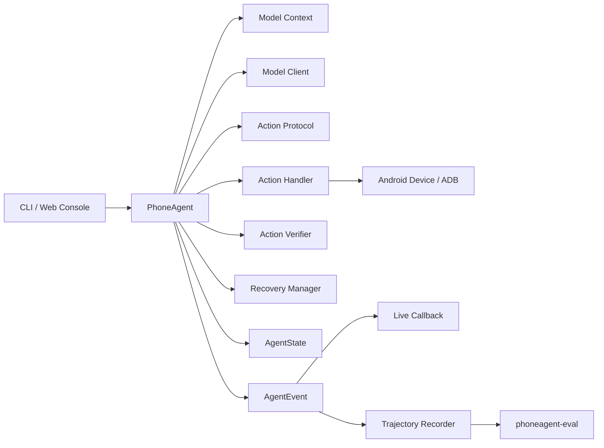
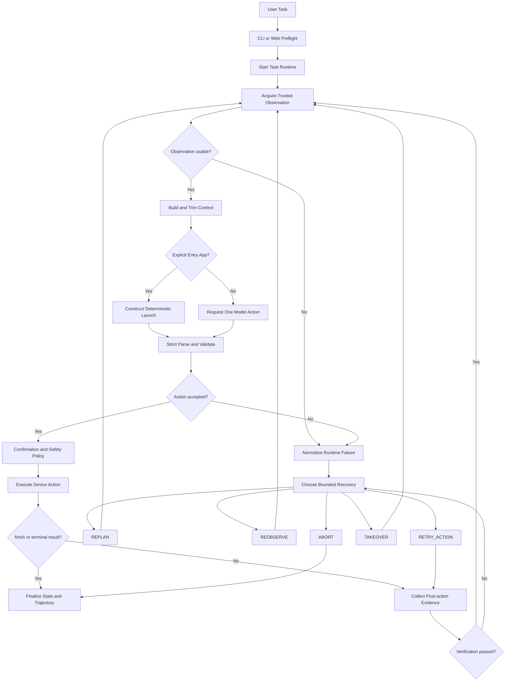

# PhoneAgent v0.2.0：Runtime Architecture 与执行闭环

> 文档类型：实现导向的运行时架构说明（Implementation-Oriented Runtime Architecture Document）
>
> 适用版本：PhoneAgent `v0.2.0`
>
> 代码基线：`7778542`
>
> 最后更新：2026-08-12

---

## 1. 文档定位

PhoneAgent 是一个运行在电脑端、通过 ADB 操作真实 Android 设备的视觉语言 Agent
研究与评测运行时。它并不试图成为通用工作流框架，也不以支持最多 App 为目标；项目真正
关心的是：一次模型决策怎样安全地变成设备动作，以及动作结果怎样留下可以检查的证据。

本文从真实代码出发，回答以下问题：

- 一个自然语言任务如何进入 Runtime？
- `run()`、`run_async()`、`step()` 与 `step_async()` 如何共享一套语义？
- 一次 Step 被拆成了哪些明确阶段？
- 模型输出经过哪些信任边界才能触达 ADB？
- 为什么 ADB 命令成功不等于动作成功，更不等于任务成功？
- 确定性首 App 启动如何减少视觉规划的不确定性？
- 哪些动作可以自动重试，哪些动作绝不能盲目重放？
- 状态、事件、轨迹与离线评测分别保存什么事实？
- 取消发生在模型流、等待或 ADB 动作期间时，Runtime 如何处理？
- Web Console 如何阻止旧任务回调污染新任务？

这篇文章不是接口手册，而是一张“从用户目标到执行证据”的代码地图。阅读后应当能够从
`src/phoneagent/agent.py` 出发，沿着协议、策略、执行、验证、恢复和轨迹模块定位一次
完整运行。

---

## 2. Runtime 的核心定位

最简化的 GUI Agent 常被描述为：

```text
截图 -> 模型 -> 点击
```

这个描述遗漏了真实设备自动化中最困难的部分：输入是否可信、输出是否可执行、动作是否
产生效果、失败是否可以安全恢复，以及最终的“成功”到底由谁证明。

PhoneAgent 将运行循环定义为：

```text
observe
  -> plan
  -> parse and validate
  -> execute
  -> verify
  -> recover or replan
  -> repeat
```

更完整地说，它是一组相互约束的边界：

```text
Trusted Observation
        +
Bounded Model Context
        +
Strict Action Protocol
        +
Confirmation Policy
        +
ADB Execution Boundary
        +
Evidence-based Verification
        +
Bounded Recovery
        +
State and Trajectory Recording
```

`PhoneAgent` 本身是编排器。它决定当前进入哪个阶段、何时调用协作者、怎样汇总结果；
具体组件只负责自己的局部语义。

例如：

- `actions.protocol` 判断文本是否是唯一合法动作；
- `actions.policy` 判断动作是否需要确认，以及时长是否合法；
- `ActionHandler` 把已验证动作映射为设备操作；
- `ActionVerifier` 判断命令和动作后证据是否成立；
- `RecoveryManager` 只选择一个受预算约束的恢复策略；
- `AgentState` 保存当前运行态；
- `TrajectoryRecorder` 保存权威历史事件流。

这条职责边界可以概括为：

> Runtime 决定“何时做什么”，专用组件决定“这件事在自己的边界内如何成立”。

---

## 3. v0.2.0 的架构收敛

v0.2.0 不是重写，也不是功能扩张，而是最后一次架构收敛。重构前，异步 Step 的大型决策树
同时承担观察、上下文、模型请求、解析、执行、验证和恢复，局部修改很容易跨越多种语义。

重构后，`_execute_step_async()` 只协调五段显式流程：

```python
observation = await self._acquire_step_observation_async()

initial_launch = self._prepare_step_context(
    observation,
    user_prompt=user_prompt,
    is_first=is_first,
)

selected = await self._select_step_response_async(
    observation,
    initial_launch=initial_launch,
    messages=messages,
)

accepted = await self._accept_step_action_async(selected, messages=messages)

return await self._execute_accepted_action_async(accepted, observation)
```

内部使用三个有类型的阶段结果传递数据：

| 类型 | 含义 |
| --- | --- |
| `_SelectedResponse` | 已从确定性首启动或模型规划中选择出一个响应 |
| `_AcceptedAction` | 响应已经通过解析和白名单检查，但尚未产生设备副作用 |
| `_RecoveryExecution` | 恢复决策、恢复结果、新观察与可选验证结果 |

这些对象不创建第二套状态机，也不直接拥有事件历史。状态迁移和事件创建仍集中在
`PhoneAgent`，从而避免“拆出很多 Service，却产生多个事实来源”。

重构同时冻结了以下兼容契约：

- `PhoneAgent.run(...)`、`run_async(...)`、`step(...)`、`step_async(...)` 保持可用；
- `phoneagent`、`phoneagent.actions`、`phoneagent.model` 和 `phoneagent.runtime`
  的公开导入保持兼容；
- CLI 参数、环境变量、Web Console 路由和三个命令行入口保持兼容；
- 严格的终端 `do(...)` / `finish(...)` 协议保持不变；
- trajectory schema 仍为 `1.0`，v0.1.4 轨迹仍可读取。

---

## 4. 系统组件与代码边界

| 层 | 主要文件 | 核心职责 |
| --- | --- | --- |
| 入口与预检 | `entrypoint.py`、`cli.py` | 加载配置、检查 ADB/设备/键盘/截图/模型服务，构造 Runtime |
| 编排层 | `agent.py` | 任务生命周期、Step 协调、状态迁移、事件创建、取消与收尾 |
| 模型上下文 | `model/context.py` | 构造截图消息、压缩上下文、注入上一动作结果与协议恢复提示 |
| 模型传输 | `model/client.py` | 同步/异步 OpenAI-compatible 流、重试、指标与统一响应累积 |
| 动作协议 | `actions/protocol.py` | AST/字面量解析、动作白名单、参数约束 |
| 动作策略 | `actions/policy.py` | 敏感操作确认规则、等待与手势时长解析 |
| 动作执行 | `actions/handler.py` | 坐标换算、ADB/设备调用、系统面板 fallback、键盘恢复 |
| 设备层 | `adb/*`、`devices/android.py` | 参数化 ADB、连接、截图、输入、前台窗口与设备观察 |
| 验证层 | `runtime/verification.py` | 命令、可观察效果和语义效果的分层证据 |
| 恢复层 | `runtime/recovery.py` | 五种恢复决策、安全重试白名单和预算 |
| 状态层 | `runtime/state.py` | 当前任务的唯一实时阶段与最新工作状态 |
| 事件与轨迹 | `runtime/events.py`、`trajectory.py` | 统一事件对象、schema 1.0、原子落盘 |
| 离线评测 | `evaluation.py` | 从轨迹生成报告，分离 runtime success 与 task success |
| Web Console | `webui/runtime.py`、`server.py` | 单任务会话、预检复用、回调隔离、轨迹读取和 HTTP 边界 |

最重要的所有权关系如下：



---

## 5. 顶层执行流



这个图表达了四个关键事实：

1. 每个任务和每个 Step 都从可信观察开始；
2. 确定性启动替代的是首次模型规划，不替代观察、协议、执行与验证；
3. 普通设备动作不会把 ADB 返回码直接当成最终成功；
4. 所有失败最终进入统一、受预算约束的恢复入口。

---

## 6. 公共入口与异步内核

### 6.1 `run()` 与 `run_async()`

`run(task)` 是同步包装：

```python
def run(self, task: str) -> str:
    return asyncio.run(self.run_async(task))
```

真正的任务循环位于 `run_async()`。它负责：

- 拒绝空任务；
- 调用 `_start_run()` 初始化 episode；
- 检查取消、最大运行时间和最大步数；
- 逐步调用 `_execute_step_async()`；
- 在终止后统一执行 `_finalize_run()`。

默认边界为：

| 配置 | 默认值 | 作用 |
| --- | ---: | --- |
| `max_steps` | 100 | 任务最大 Step 数 |
| `max_runtime_seconds` | 900 | 任务最大运行时间；0 表示不启用 |
| `max_consecutive_failures` | 3 | 连续失败上限 |
| `max_repeated_actions` | 3 | 停滞画面上的重复坐标动作上限 |

### 6.2 `step()` 与 `step_async()`

`step()` 只执行一个 observe-plan-execute-verify 周期，适合调试器、外部评测器和 Web
控制器逐步接管：

```python
result = agent.step("打开设置并进入关于手机")

while not result.finished:
    inspect(result)
    result = agent.step()
```

首次调用必须给任务；已结束的 Agent 再开始新任务时也必须给任务。`step_async()` 与
`run_async()` 最终复用同一个异步 Step 内核，不存在两套 Agent 行为。

### 6.3 为什么异步路径是唯一规范实现

模型流式请求、可取消等待和 Web Console 都天然涉及异步生命周期。如果同时维护完整同步
和异步实现，协议错误、指标、取消与恢复很容易产生语义漂移。

因此 v0.2.0 的策略是：

```text
public sync API
    -> asyncio.run(...)
        -> canonical async runtime
```

同步与异步模型传输仍保留各自 I/O 机制，但共享响应累积、指标归一化和最终
`ModelResponse` 构造。

---

## 7. 任务初始化与收尾

### 7.1 `_start_run()`

一次新任务启动时，Runtime 会：

1. 清空模型上下文、步数、待复用观察和严格协议恢复提示；
2. 清除取消信号；
3. 调用 `AgentState.start(goal)` 进入 `INITIALIZING`；
4. 重置 `RecoveryManager`；
5. 把任务传给 `ActionHandler`；
6. 创建新的 `TrajectoryRecorder`；
7. 记录阶段变化和 `START` 事件。

v0.2.0 不会在任务开始时枚举或缓存设备上的全部应用，也不存在动态 App Catalog TTL、
候选数量或 App Context 开关。这是旧版本文档中最需要修正的地方。

### 7.2 `_finalize_run()`

所有终止路径最终收敛到同一处：

- 将状态进入 `COMPLETED`、`FAILED` 或 `CANCELLED`；
- 记录终态阶段与 `FINISH` / `ERROR` 事件；
- 标记 trajectory 结果；
- 恢复首次 `Type` 前保存的原始 Android 输入法；
- 以临时文件加 `os.replace()` 的方式原子保存轨迹；
- 更新 `last_trajectory_path`。

输入法恢复失败不会抹掉原任务结果，而会作为可见错误写入收尾证据。

---

## 8. 单步内核的五个显式阶段

### 8.1 阶段一：`_acquire_step_observation_async()`

每个 Step 首先进入 `OBSERVING`，然后从两种来源取得观察：

1. 上一动作验证阶段留下的 `_pending_observation`；
2. `AndroidDevice.observe()` 产生的新观察。

Runtime 会在模型规划前拒绝：

- 观察调用异常；
- 截图不可用；
- 空白或受保护屏幕；
- 已收到取消请求。

核心不变量是：

> 屏幕不可观察时，不允许模型猜测坐标继续操作。

观察重试由 `observation_retries=2` 和 `observation_retry_delay=0.5` 控制。验证阶段
还有独立的动作后观察重试配置，避免把两种失败预算混为一谈。

### 8.2 阶段二：`_prepare_step_context()`

Runtime 将以下信息组成一个截图支持的 user turn：

- 用户目标；
- 当前截图；
- 当前 App、屏幕尺寸和系统面板状态；
- Runtime phase；
- 上一步执行、验证与恢复摘要；
- 停滞观察次数；
- Saved Notes；
- API callback 是否可用；
- 可选的严格协议恢复提示。

随后 `trim_context()` 只保留：

```text
system message
  + 最近 N 个完整 user/assistant pair
  + 当前 user turn
```

默认 `context_turns=12`。模型请求结束后，历史 user message 中的图片会被移除，文字和
动作历史继续保留。这样可以控制多模态请求体，但也意味着 `_context` 不是完整视觉轨迹；
完整审计事实应从 trajectory 读取。

### 8.3 阶段三：`_select_step_response_async()`

这一阶段有两个规划来源：

#### 确定性首 App 启动

如果首轮任务包含明确入口 App，例如：

```text
打开微信
在支付宝里搜索账单
进入设置查看关于手机
```

`infer_task_entry_app()` 会使用静态别名表和显式任务措辞解析入口包名。只有目标不在前台时，
Runtime 才构造：

```python
do(action="Launch", app="目标应用")
```

其来源记录为 `runtime_initial_launch`。

这条路径仍然遵守以下规则：

- 任务先获得可信观察；
- `Launch` 仍通过同一协议和执行器；
- 设备层先用 `pm path` 检查包是否安装；
- 启动命令受 `app_launch_timeout_seconds=15` 限制；
- 动作后验证目标包是否进入前台；
- 启动只完成入口动作，不自动宣称整个复杂任务成功。

如果别名未知、包未安装、目标已在前台或确定性启动失败，控制权会留给或返回模型循环。
Runtime 不会通过桌面图标文字或文件夹位置进行视觉猜测。

#### 模型规划

没有明确入口 App 时，`_request_step_model_response_async()` 记录 `MODEL_REQUEST`，然后
调用统一异步请求路径。响应包含：

- reasoning / thinking；
- terminal action；
- 原始模型内容；
- finish reason；
- 请求重试次数；
- 首 Token、思考结束和总耗时；
- prompt、completion 和 total Token；
- 截断诊断。

同步与异步 OpenAI-compatible transport 使用同一个响应累积器，因此不会分别解释 usage、
reasoning content 或动作边界。

### 8.4 阶段四：`_accept_step_action_async()`

模型输出被视为不可信文本。只有完成以下检查后，动作才会获得执行权：

1. 响应末尾存在唯一、完整的 `do(...)` 或 `finish(...)`；
2. AST 结构是允许的函数调用；
3. 所有参数都是可接受的 Python 字面量；
4. 动作名称位于白名单；
5. 必填字段、坐标、持续时间和其他参数合法。

解析成功后，Runtime：

- 更新完整动作签名和坐标签名；
- 记录 `ACTION` 事件；
- 将历史截图从模型上下文移除；
- 只把规范动作调用写回 assistant history；
- 进入 `EXECUTING`。

### 8.5 阶段五：`_execute_accepted_action_async()`

执行阶段分成三步：

```text
execute through ActionHandler
    -> handle terminal action if needed
    -> verify and recover ordinary actions
```

普通动作先进入 `_execute_device_action_async()`，记录命令结果，再由
`_evaluate_action_result_async()` 判断是否需要动作后验证或恢复。

`_execute_device_action_async()` 会在调用 `ActionHandler` 之前执行停滞与重复坐标保护。
被阻断的动作会形成结构化 `ActionResult`，但不会产生设备副作用。

---

## 9. 严格动作协议：哪段文本拥有执行权

PhoneAgent 允许模型在动作前输出推理：

```text
当前页面已经打开设置，关于手机位于列表底部，需要继续向上滑动页面。
do(action="Swipe", start=[500, 800], end=[500, 250])
```

但整个响应必须以唯一的终端调用结束。以下输出都会被拒绝：

- JSON 或 XML 动作；
- Markdown code fence；
- 多个 `do(...)`；
- 动作之后还有额外文字；
- 不完整字符串或被截断调用；
- provider 私有的坐标标记；
- 不在白名单中的动作；
- 坐标越界或参数类型错误。

协议层使用 `ast.parse` 分析调用结构，并只对参数字面量使用安全的字面量处理。它不会：

```python
eval(model_output)
exec(model_output)
```

这条设计牺牲了对模糊输出的宽容，换来三个收益：

1. 执行权边界明确；
2. 协议失败可以稳定复现；
3. 模型文本无法直接获得 Python 执行能力。

协议错误会变成 `model_protocol_error`、`action_parse_error` 或
`model_output_truncated`，随后进入统一恢复流程。`prepare_protocol_recovery()` 会移除
未完成的 user turn、压缩旧上下文，并为下一轮加入简短严格提示，而不是猜测修复动作。

---

## 10. Protocol、Policy 与 Handler 的分层

v0.2.0 将原本集中在动作处理模块中的职责拆成三层：

```text
actions.protocol
    parse + validate, no side effects

actions.policy
    confirmation + duration rules, no device I/O

actions.handler
    validated action -> device/API/human side effect
```

### 10.1 支持的动作

| 类别 | 动作 |
| --- | --- |
| App 与导航 | `Launch`、`Back`、`Home` |
| 坐标与输入 | `Tap`、`Double Tap`、`Long Press`、`Swipe`、`Type` |
| 系统面板 | `OpenNotifications`、`OpenQuickSettings`、`CloseSystemPanel` |
| Runtime 工具 | `Wait`、`Note`、`Call_API` |
| 人工协作 | `Take_over`、`Interact` |
| 终止 | `finish(success=..., message=...)` |

`ActionHandler.execute()` 会对注入的程序化动作再次调用 `validate_action()`。也就是说，
即使动作并非来自模型，执行边界仍不会默认信任上游。

### 10.2 坐标系统

模型使用归一化的 `[0, 999]` 坐标空间。执行层按当前真实显示尺寸换算：

```python
pixel = round(relative / 999 * (size - 1))
```

换算结果会被限制在有效像素范围内。这样模型输入截图可以缩放，动作仍能映射到设备的真实
分辨率。

### 10.3 敏感操作确认

动作被标记为 sensitive、requires confirmation，或策略判断其具有高风险时，会暂停到
confirmation callback。用户拒绝产生 `user_cancelled`，该动作终止，Recovery 不得覆盖
用户意图。

### 10.4 输入法生命周期

第一次 `Type` 前，执行层记录设备原始输入法。任务期间可以继续复用 ADB Keyboard，任务
结束时再统一恢复原输入法。这样既避免每一步重复切换，也避免 Agent 完成后把测试键盘留给
用户。

---

## 11. 系统面板为何是语义动作

`OpenNotifications` 和 `OpenQuickSettings` 不等同于普通 `Swipe`。

执行层首先调用 allowlisted `cmd statusbar` 命令；随后验证层检查 WindowManager 是否
出现通知面板、快捷设置或 OEM 控制中心。如果主命令失败或没有产生面板语义证据，Runtime
允许一次内部的屏幕顶部边缘手势 fallback。

```text
cmd statusbar expand-...
    -> observe focused/visible system window
        -> if absent, one normalized edge gesture
            -> observe and verify again
```

fallback 对模型规划不可见，但主尝试、fallback 尝试和最终 transport 都保存在执行元数据
中。`CloseSystemPanel` 使用 `cmd statusbar collapse`，不会盲目发送 Back；已经关闭的
面板可以按幂等语义通过。

这个设计说明：动作名应表达意图，底层 transport 可以根据确定性证据选择有限实现。

---

## 12. 动作验证：三层成功语义

PhoneAgent 将三个事实分开：

```text
command_success
    != observable_effect_verified
    != semantic_effect_verified
```

| 层级 | 问题 | 示例 |
| --- | --- | --- |
| Command | ADB/Android 命令是否被接受？ | `input tap` 返回 0 |
| Observable | 设备状态是否出现可测变化？ | 前台包改变或内容区域像素变化 |
| Semantic | 变化是否证明动作语义成立？ | `Launch` 后前台包等于目标包 |

### 12.1 坐标动作的证据上限

对于 `Tap`、`Swipe`、`Type` 等动作，屏幕变化可以证明发生了可观察效果，却通常不能独立
证明“点击了语义上正确的目标”。

例如：

```json
{
  "command_success": true,
  "observable_effect_verified": true,
  "semantic_effect_verified": null
}
```

这里的 `null` 不是缺陷掩盖，而是明确表示 Android 没有提供足够确定性证据。

### 12.2 图像比较与系统区域

普通视觉比较会裁掉顶部和底部系统区域，减少状态栏时钟、信号、电量和导航栏动画导致的
假阳性。默认参数为：

| 参数 | 默认值 |
| --- | ---: |
| `visual_change_threshold` | 0.002 |
| `image_compare_size` | 128 |
| `crop_top_ratio` | 0.04 |
| `crop_bottom_ratio` | 0.04 |

如果动作明确目标位于系统区域，则改为比较完整屏幕。

观察同时保存完整截图 hash 与应用内容区域 hash。停滞画面和重复动作判断优先使用
`content_sha256`，避免系统 chrome 的微小变化伪造进展。

### 12.3 动作特定验证

- `Launch`：比较目标包与动作后前台包；
- `Home`：检查 Launcher/Home 语义；
- 系统面板：检查 WindowManager 面板证据；
- 普通坐标动作：比较前后台与视觉变化；
- `Note`、`Call_API`：不要求设备屏幕效果；
- `Take_over`、`Interact`：以接管后的新观察继续；
- `finish`：不修改设备，设备验证被跳过。

`finish(success=True)` 只能表示 Runtime 接受了模型的终止声明，不能独立证明真实任务已经
正确完成。这一边界会在离线评测层再次处理。

---

## 13. 动作后观察缓存

普通动作验证需要取得动作后观察。如果下一 Step 再立即截图，会产生重复 I/O 和状态漂移：

```text
Step N verification: observe after
Step N+1 start:       observe again
```

因此验证得到的可信观察会放入 `_pending_observation`：

```text
post-action observation
    -> _pending_observation
        -> next _next_observation_async()
            -> source = verification_cache
```

缓存是一次性消费的，读取后立即清空。它带来以下收益：

- 减少 ADB 截图调用；
- 降低真实设备延迟；
- 让下一轮规划看到与上一轮验证一致的状态；
- 避免两次相邻截图之间的动画或页面漂移。

---

## 14. 重复动作与停滞保护

Runtime 同时维护两种签名：

- 完整动作签名：用于观测动作序列；
- 坐标签名：只提取 `element`、`start` 或 `end`。

数字会先归一化，因此 `250` 与 `250.0` 不会被误认为不同坐标。坐标签名故意忽略
description，防止模型只改写自然语言描述就绕过重复点击保护。

只有动作真的包含坐标，且应用内容画面持续停滞时，重复坐标限制才有意义。因此：

- 重复点击同一位置不能通过改写描述绕过；
- `Type` 和 `Launch` 不会因为文字相似被错误归为坐标重复；
- 合理的同一动作在画面持续变化时不会被机械阻断。

触发保护后产生 `repeated_action_blocked`，由 RecoveryManager 选择重新观察或重新规划，
而不是继续发送相同副作用。

---

## 15. 有界恢复策略

Recovery 只允许五种策略：

| 策略 | Runtime 行为 | 典型场景 |
| --- | --- | --- |
| `REPLAN` | 将结构化失败交回模型，下一轮选择不同动作 | 协议错误、点击无效果、目标策略不合适 |
| `REOBSERVE` | 获取一份新的可信观察 | 截图失败、设备瞬态、前台状态不确定 |
| `RETRY_ACTION` | 重新执行一次安全动作并再次验证 | 非敏感 `Launch`、`Wait`、`Home` |
| `TAKEOVER` | 等待人工处理，再重新观察 | 受保护页面、验证码、登录或权限 |
| `ABORT` | 终止任务 | 取消、预算耗尽或不可恢复错误 |

默认恢复预算：

| 配置 | 默认值 |
| --- | ---: |
| `max_total_recoveries` | 8 |
| `max_attempts_per_failure` | 2 |
| `retry_delay_seconds` | 0.35 |
| `allow_safe_action_retry` | true |
| `allow_takeover` | true |

### 15.1 安全重试白名单

只有以下动作可以在非敏感情况下自动重试一次：

```text
Launch · Wait · Home
```

以下动作不会被 Recovery 自动重放：

```text
Tap · Type · Swipe · Back · Double Tap · Long Press
```

原因并不只是“这些动作可能失败”，而是 Runtime 无法证明重放不会制造新的副作用。例如：

- 再次 Tap 可能二次提交；
- 再次 Type 可能重复输入；
- 再次 Back 可能越过目标页面；
- 再次 Swipe 可能改变列表位置；
- 长按可能触发删除或上下文菜单。

### 15.2 恢复成功不等于原动作成功

`REPLAN` 或 `REOBSERVE` 可以被正确执行，但原动作的验证仍然是失败：

```text
recovery process succeeded
    != original action succeeded
```

轨迹会同时保留原失败和恢复结果，离线评测不会把一次成功的恢复决策改写成原动作成功。

### 15.3 为什么没有更多恢复分支

v0.2.0 主动删除了隐式 relaunch、backtrack、home reset 等独立分支。需要导航重置时，模型
应当在新观察后显式选择 `Launch`、`Back` 或 `Home`。恢复状态空间越小，行为越容易解释、
测试和审计。

---

## 16. 状态机：当前事实的唯一来源

`AgentState.phase` 是实时阶段的唯一来源：

```text
IDLE
  -> INITIALIZING
  -> OBSERVING
  -> PLANNING
  -> EXECUTING
  -> VERIFYING
  -> RECOVERING
  -> WAITING_USER
  -> COMPLETED / FAILED / CANCELLED
```

实际转换不是一条固定直线。例如验证成功会回到 `OBSERVING`，恢复可能进入
`EXECUTING` 或 `WAITING_USER`。`_ALLOWED_TRANSITIONS` 显式声明合法边，非法转换抛出
`StateTransitionError`。

终态必须通过：

- `state.finish(success=..., message=...)`；
- `state.cancel(message=...)`。

普通 `transition()` 不能直接进入终态，避免调用方忘记写入 success、final message 和
finished timestamp。

`AgentState` 只保存当前工作状态：

- 当前 goal、phase 与 step；
- 当前和目标 App；
- 最新观察、动作与执行；
- 重复动作和停滞计数；
- 连续失败与恢复次数；
- 最终状态和时间。

它不保存第二份阶段历史。历史事实属于 trajectory event stream。

---

## 17. 事件与轨迹：历史事实的唯一来源

Runtime 事件包括：

```text
START · PHASE_CHANGE · OBSERVATION
MODEL_REQUEST · MODEL_RESPONSE · THINKING · METRICS
ACTION · EXECUTION · VERIFICATION · RECOVERY
ERROR · FINISH
```

每个事件只构造一次 `AgentEvent`。同一个事件实例会：

1. 发送给实时 callback；
2. 序列化进入 `TrajectoryRecorder`。

这避免 Web Console 和保存轨迹分别生成 timestamp、step、message 或 payload，最终形成
两份互相矛盾的历史。

trajectory schema `1.0` 的顶层结构包含：

```json
{
  "schema_version": "1.0",
  "run_id": "...",
  "task": "...",
  "started_at": 0,
  "finished_at": 0,
  "duration_seconds": 0,
  "success": true,
  "final_message": "...",
  "event_count": 0,
  "events": [],
  "state": {}
}
```

保存过程先写同目录临时文件，再用 `os.replace()` 原子替换最终路径，避免进程中断留下半个
JSON 文件。

轨迹可能包含任务文本、模型内容、App 包名、时间、动作参数和验证证据。公开前必须脱敏；
默认 `runs/` 目录不应直接作为网站或评测数据发布。

---

## 18. 协作式取消

`request_cancel()` 设置线程安全取消事件。取消语义是：

> 在下一个安全检查点阻止后续动作，而不是假装撤销已经发送的设备命令。

不同阶段的行为如下：

| 取消时机 | Runtime 行为 |
| --- | --- |
| 同步模型流 | 请求局部 watcher 关闭活动 stream |
| 异步模型流 | 协调任务取消并关闭异步 stream |
| `Wait` | 复用同一个取消事件，立即唤醒 |
| 动作前 | 不再发送新的设备动作 |
| ADB 原子动作已发送 | 等当前命令返回，再停止后续动作 |
| 用户确认已拒绝 | 产生终止性 `user_cancelled`，Recovery 不覆盖 |

这里必须接受一个物理事实：已经发出的 Tap 无法通过软件“回滚”。正确设计不是声称取消具有
事务语义，而是明确取消检查点和剩余副作用边界。

---

## 19. 模型响应语义的一致性

同步和异步 OpenAI-compatible 客户端具有不同的网络与取消机制，但共享一套响应状态：

- reasoning/content 累积；
- terminal action 边界检测；
- time to first token；
- time to thinking end；
- finish reason；
- Token usage 归一化；
- truncation 判断；
- 最终 `ModelResponse` 或 `ModelProtocolError`。

这一设计解决了常见漂移：

```text
sync accepts a response
async rejects the same response

or

sync records usage
async loses usage
```

对于 reasoning-first provider，预检只要 reasoning 或 content 存在即可证明端点返回了有效
选择；真正运行时仍要求最终存在合法 terminal action。

---

## 20. Web Console 的任务隔离

Web Console 在一个服务会话中复用已通过预检的 Agent，同时只允许一个活动任务。难点不只是
“加一把锁”，而是前一线程进入终态后，延迟 callback 仍可能晚到并污染下一任务。

v0.2.0 使用任务代际标识解决这个问题：

```text
task A starts with generation A
    -> event / note / prompt callback carries A

task B starts with generation B
    -> callback carrying A is ignored
    -> only callback carrying B may mutate B snapshot
```

标识通过 `ContextVar` 进入包括 `asyncio.to_thread` 在内的回调路径。旧 worker 必须完成
清理，Runtime 才允许开始下一任务。

Web Console 还具有以下边界：

- 启动时一次性检查 ADB、设备、ADB Keyboard、截图和模型 API；
- 只绑定本地调试用途；
- HTTP 层限制路径、下载文件名和同源写请求；
- trajectory 读取限制在配置目录和规范文件名；
- 前端使用原生 ES modules 拆分 API、状态、时间线和 Token 用量。

---

## 21. 离线评测：Runtime 成功不是任务正确

`phoneagent-eval` 在不初始化模型和设备的情况下读取 trajectory，汇总：

- Step 与模型请求数；
- 动作类型；
- 恢复次数；
- 结构化错误码；
- 运行与模型耗时；
- provider 返回的 Token usage；
- runtime success；
- 可选的外部 task success。

两种成功的定义必须分开：

```text
runtime_success
    = Runtime accepted finish(success=True)

task_success
    = external human or deterministic evaluator judgment
```

外部标注使用 `run_id` 关联：

```json
{
  "runs": {
    "trajectory-run-id": {
      "task_success": true,
      "domain": "settings",
      "notes": "Confirmed target Activity and visible title"
    }
  }
}
```

如果没有外部标注，`task_success` 必须保持 `null`。评测层不会用模型自己的
`finish(success=True)` 填补它。

这条边界使项目能够诚实表达：

- 命令是否执行；
- 屏幕是否变化；
- 动作语义是否有确定性证据；
- Runtime 是否接受终止；
- 外部评测是否确认任务正确。

---

## 22. 一个完整任务如何流动

以“打开设置并进入关于手机”为例：

### Step 1：可信观察与确定性入口

1. Runtime 获取当前前台页面和截图；
2. 任务解析出明确入口 App“设置”；
3. 如果设置不在前台，构造 `Launch`，来源为 `runtime_initial_launch`；
4. 协议层验证动作；
5. 设备层检查包并发送启动 intent；
6. 验证前台包是否变为设置；
7. 动作后观察缓存给下一 Step。

### Step 2：模型基于新画面规划

1. 下一 Step 复用验证后的设置截图；
2. 上一动作、验证证据和当前阶段进入 prompt；
3. 模型返回一个 `Swipe`；
4. Runtime 验证协议、坐标和重复保护；
5. 执行 Swipe；
6. 比较应用内容区域，确认发生可观察变化。

### Step 3：继续导航

模型根据新截图再次输出单动作。每个动作之后都重新观察和验证，不允许模型基于 Step 1 的
过期画面一次性输出长动作序列。

### Step N：终止与外部判定

模型输出：

```text
finish(success=True, message="已进入关于手机页面")
```

Runtime 将其记录为 runtime success、恢复原输入法并原子保存轨迹。若要形成可报告的任务
成功率，还需要外部检查目标 Activity、页面标题或其他确定性证据，并写入 task annotation。

---

## 23. 关键数据结构

### 23.1 `AgentConfig`

除前文的运行边界外，主要配置还包括：

| 字段 | 默认值 | 含义 |
| --- | ---: | --- |
| `context_turns` | 12 | 模型保留的完整历史轮数 |
| `observation_retries` | 2 | Step 初始观察额外重试次数 |
| `observation_retry_delay` | 0.5 | 初始观察重试基础延迟 |
| `trajectory_dir` | `runs` | 轨迹目录 |
| `save_trajectory` | true | 是否保存轨迹 |
| `allow_fallback_screenshot` | false | 是否允许设备截图降级路径 |
| `app_launch_timeout_seconds` | 15 | App 启动命令上限 |
| `verification` | 配置对象 | 验证策略与视觉阈值 |
| `recovery` | 配置对象 | 恢复开关与预算 |

`__post_init__()` 在 Runtime 启动前拒绝非法负数、零值和越界阈值，属于配置层 fail-fast。

### 23.2 `StepResult`

```python
@dataclass(slots=True)
class StepResult:
    success: bool
    finished: bool
    action: dict[str, Any] | None
    thinking: str
    message: str | None = None
    raw_model_output: str | None = None
    error_code: str | None = None
    command_success: bool | None = None
    verification: dict[str, Any] | None = None
    recovery: dict[str, Any] | None = None
    phase: str | None = None
```

需要特别区分：

- `success`：当前 Step 综合验证与恢复后的结果；
- `finished`：整个任务是否应结束；
- `command_success`：设备命令是否成功；
- `verification`：动作后证据；
- `recovery`：失败后的决策与执行结果。

### 23.3 `VerificationResult`

`VerificationResult` 保留 `PASSED`、`FAILED`、`INCONCLUSIVE` 和 `SKIPPED`，同时保存：

- policy；
- command success；
- observable / semantic evidence；
- screen / app change；
- visual difference ratio；
- error code；
- action-specific metadata。

“未能证明”与“证明失败”不是同一件事，因此语义证据允许为 `None`。

---

## 24. 设计不变量

### 24.1 每个 Step 从可信观察开始

确定性启动也不能绕过首次观察。受保护或空白屏幕上不猜坐标。

### 24.2 模型输出默认不可信

只有唯一终端调用通过 AST、字面量、白名单和参数检查后才拥有执行权。

### 24.3 一个模型响应只执行一个动作

设备状态在动作后可能改变。单动作闭环牺牲部分速度，换取新观察、可验证性和更小的过期状态
风险。

### 24.4 命令成功与效果成功分离

ADB 返回 0 只证明 transport 成功，不证明点击目标、前台包或任务语义。

### 24.5 Recovery 必须有界

恢复同时受单失败 episode 和整个任务预算限制；潜在副作用动作不自动重放。

### 24.6 State 与 Event Stream 不能互相替代

State 是最新工作快照，Event Stream 是权威历史。只维护一种实时 phase 和一种历史事实源。

### 24.7 取消不能伪装成回滚

取消阻止后续动作，但不会撤销已经下发的原子 ADB 输入。

### 24.8 Runtime 完成不能伪装成任务正确

task success 必须来自模型外部的人类或确定性判定。

---

## 25. 扩展指南

### 25.1 新增一种动作

至少检查以下边界：

1. 在 `actions.protocol` 添加动作名和参数验证；
2. 在 `actions.policy` 定义确认、风险与时长规则；
3. 在 `ActionHandler` 添加设备执行；
4. 在 `ActionVerifier` 定义该动作能够获得的证据等级；
5. 决定它是否可以自动重试，默认答案应为“不可以”；
6. 添加协议、执行、验证、恢复和兼容测试；
7. 确保 trajectory 元数据足以解释 transport 与结果。

### 25.2 新增验证证据

验证器应回答：

- 证据来自 Android 确定性状态还是视觉近似？
- 它证明的是 observable effect 还是 semantic effect？
- 失败与 inconclusive 如何区分？
- OEM ROM 差异会不会产生假阳性？
- 证据能否在 trajectory 中脱离日志独立解释？

不要直接在 `PhoneAgent` 主循环里堆动作特例。

### 25.3 新增恢复策略

在扩展 `RecoveryStrategy` 前，应先判断该行为能否由模型在新观察后显式选择。只有具备独立
安全语义、清晰预算和可测试故障模型时，才值得增加恢复分支。

### 25.4 接入新 UI

UI 应消费 `AgentEvent` 和状态 snapshot，不应重新推导第二套 phase。跨线程或跨任务回调
必须携带任务身份，并在写入当前视图前验证归属。

### 25.5 接入评测

优先读取 trajectory 事件流，而不是终端打印。所有成功率至少应附带：

- 任务集合；
- 初始设备状态；
- 设备、Android/ROM 与模型；
- 重复次数；
- 外部判定规则；
- 失败轨迹是否计入分母；
- 隐私与脱敏方法。

---

## 26. 测试与发布证据

v0.2.0 发布门禁包括：

- 161 个 Python 测试与 43 个子测试；
- Ruff；
- Web Console JavaScript 语法检查；
- Python source/wheel 构建；
- SHA256 制品校验；
- 干净虚拟环境安装；
- `phoneagent`、`phoneagent-web`、`phoneagent-eval` 三个入口验证；
- 协议、状态、轨迹、恢复和验证核心模块的分支覆盖门槛；
- 截图超时、ADB 断连、模型协议截断、前台包不匹配和 Web 延迟回调等故障注入。

真机发布 smoke 在 vivo Android 16 设备上覆盖：

- Launch；
- Tap；
- Type 与输入法恢复；
- 系统面板主命令和手势 fallback；
- 取消；
- 多步执行。

其中一次探索性 Tap 失败被保留在结果中，用于说明错误方向、协议错误和步数耗尽如何进入
结构化证据。这个小规模矩阵只能证明单设备 release gate，不代表跨 ROM 或通用任务集性能。

---

## 27. 当前能力边界

PhoneAgent v0.2.0 仍有明确限制：

- 普通坐标动作的视觉变化不能独立证明点击目标语义正确；
- Secure Screen 或受保护页面可能无法截图；
- 不同 Android 版本、OEM ROM、Launcher 和权限模型存在差异；
- 完整任务结束仍由规划模型提出；
- 静态 App 别名表不是完整的设备应用目录；
- 系统面板窗口识别需要兼容 OEM 命名；
- 单动作闭环会增加模型请求次数和延迟；
- 当前 Runtime 不提供并行子任务、多 Agent 编排或持久化工作流恢复。

这些限制没有通过“成功率包装”隐藏，而是被设计为验证中的 `None`、结构化 error code、
失败 trajectory 和外部 task annotation。

---

## 28. 推荐代码阅读顺序

如果第一次阅读项目，建议按以下顺序：

1. `src/phoneagent/agent.py`：先看公共入口、`_execute_step_async()` 和五个阶段；
2. `src/phoneagent/runtime/state.py`：理解唯一 phase 和合法迁移；
3. `src/phoneagent/actions/protocol.py`：理解执行权边界；
4. `src/phoneagent/actions/policy.py` 与 `handler.py`：理解策略和副作用分离；
5. `src/phoneagent/runtime/verification.py`：理解三层证据；
6. `src/phoneagent/runtime/recovery.py`：理解安全重试白名单与预算；
7. `src/phoneagent/runtime/events.py` 与 `trajectory.py`：理解历史事实源；
8. `src/phoneagent/model/context.py` 与 `client.py`：理解上下文和流式语义；
9. `src/phoneagent/evaluation.py`：理解 runtime/task success 分离；
10. `webui/runtime.py`：理解任务代际和并发隔离。

---

## 29. 总结

PhoneAgent v0.2.0 的核心价值不是“模型可以点手机”，而是把这个动作放进一个受约束、可观察、
可恢复、可评测的 Runtime：

```text
可信观察
  -> 有界上下文
  -> 唯一终端动作
  -> 协议与策略检查
  -> ADB 原子执行
  -> 分层验证证据
  -> 有界恢复
  -> 单一状态机
  -> 权威事件轨迹
  -> 外部任务评测
```

从工程角度看，v0.2.0 最重要的不是新增了多少功能，而是每类复杂性都拥有明确归属：

- 模型不确定性由严格协议和重新规划处理；
- 设备不确定性由观察、验证和结构化错误处理；
- 副作用风险由确认策略与安全重试白名单处理；
- 生命周期复杂性由唯一状态机和协作式取消处理；
- 可观测性由统一事件与原子 trajectory 处理；
- 结果可信度由 runtime success 与 task success 的分离处理；
- Web 并发由任务代际和单活动任务约束处理。

这使 PhoneAgent 从“截图—模型—点击”的演示循环，收敛为一个能够被测试、解释、复现和诚实
评估的 Android Agent Research Runtime。
