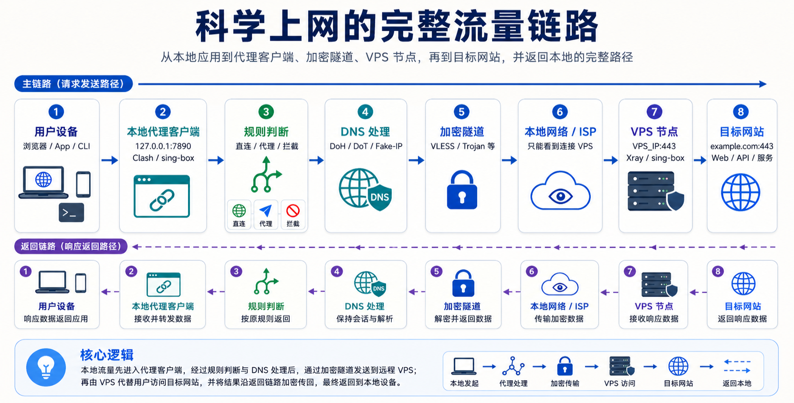

# 科学上网的流量链路

> 首先需要强调：不同国家和地区对于代理、VPN、跨境访问、加密通信有不同的法律法规和使用要求。从技术学习角度看，理解代理、DNS、TLS、VPS 和网络链路非常有价值。但技术本身只是工具，关键在于使用边界。

很多人第一次接触“科学上网”时，往往会把注意力放在“买节点”“导入订阅”“打开客户端”这些操作上。但如果只停留在操作层面，我们很容易产生一个误解：科学上网似乎只是某个工具、某个软件、某个节点服务商提供的功能。实际上，从技术角度看，科学上网本质上是一条完整的网络流量链路。它背后涉及：

- 本地应用程序如何发起请求；
- 本地代理客户端如何接管流量；
- 代理规则如何判断直连、代理或拦截；
- DNS 请求如何避免泄漏；
- 加密隧道如何建立；
- VPS（Virtual Private Server） 节点如何接收连接；
- 端口如何决定服务入口；
- VPS 如何代替本地访问目标网站；
- 目标网站如何把数据返回给用户。

所以，理解科学上网，最重要的不是记住某个一键脚本，而是理解：

> 一条网络请求从本地设备出发，到达本地代理客户端，再经过加密隧道连接到 VPS 节点，最后访问目标网站并返回本地的完整过程。

## 一. 正常上网的流量路径

在不使用代理的情况下，我们访问一个网站时，流量的大致路径如下：

```
用户设备
   ↓
本地网络
   ↓
运营商 ISP
   ↓
互联网骨干网络
   ↓
目标网站
```

例如，你在浏览器中访问一个网站，本地设备会先进行 DNS 解析，拿到目标网站的 IP 地址，然后通过本地网络和运营商网络直接连接目标服务器。这个过程看起来很简单，但实际上，中间会经过很多网络节点。这些中间网络通常可以看到一些连接层面的信息，例如：你连接了哪个 IP；你查询了哪个域名；你使用了什么端口；连接持续了多久；TLS 握手暴露出的部分特征；流量大小和时间分布。

即使 HTTPS 已经加密了网页正文内容，中间网络仍然可以观察到一些元信息。这也是为什么现代网络访问中，DNS、TLS、代理、端口和加密隧道都变得非常重要。

## 二. 科学上网的基本思路

科学上网的基本思路其实很简单：

> 不让本地设备直接访问目标网站，而是先连接到一台远程服务器，再由这台远程服务器访问目标网站。

这台远程服务器通常就是我们说的：VPS 节点。

于是，流量路径就变成了：

```
用户设备
   ↓
本地代理客户端
   ↓
加密隧道
   ↓
本地网络 / ISP / 互联网
   ↓
VPS 节点
   ↓
目标网站
```

VPS 节点在这里扮演的角色是：代替本地设备访问目标网站，并把访问结果返回给本地设备。因此，目标网站看到的访问来源通常不是你的本地 IP，而是 VPS 节点的 IP。

上述的描述仍然不够准确，因为真实的网络连接并不是只看“哪台机器”，还要看“这台机器上的哪个服务”。这里就涉及一个非常重要的概念：端口。

如果说 IP 地址决定了：访问哪一台机器；那么端口决定的就是：访问这台机器上的哪一个服务。

加入端口之后，科学上网的流量链路可以写得更精确：

```
本地应用
   ↓
本地代理监听端口
   ↓
远程 VPS 服务端口
   ↓
目标网站服务端口
```

这就是科学上网流量链路中非常关键的一层。

## 三. 什么是端口

一台服务器可以同时运行很多服务。例如，一台 VPS 上可能同时运行：

```
22    → SSH 远程登录
80    → HTTP 网站服务
443   → HTTPS 网站服务
3306  → MySQL 数据库
6379  → Redis 服务
自定义端口 → 代理服务端
```

所以访问一台服务器时，完整的目标通常不是单纯的 IP，而是：IP + Port 。

例如：

```
1.2.3.4:22
1.2.3.4:80
1.2.3.4:443
1.2.3.4:8080
```

可以这样理解：IP 是楼的地址，端口是楼里不同房间的门牌号。你知道楼在哪里还不够，还要知道你要进入哪个房间。

## 四. 本地端口：代理客户端如何接管流量

科学上网的第一步并不是 VPS，而是本地代理客户端。常见本地代理客户端包括：

- Clash 系列客户端；
- sing-box 客户端；
- v2rayN；
- ...

这些客户端会在本地监听一些端口。例如：

```
127.0.0.1:7890  → HTTP 代理端口
127.0.0.1:7891  → SOCKS5 代理端口
127.0.0.1:9090  → 控制面板端口
```

也就是说，代理客户端会在你的电脑上启动一个本地服务。浏览器、终端、系统代理或者 TUN 虚拟网卡会把应用程序的网络请求发送给这个本地端口。例如：

```
浏览器
   ↓
127.0.0.1:7890
   ↓
本地代理客户端
```

所以，本地代理客户端并不是“凭空接管流量”。它本质上是：在本机监听一个端口，等待应用程序把网络请求交给它处理。

## 五. 规则判断：直连、代理与拦截

本地代理客户端收到请求后，并不会无脑把所有流量都发到 VPS。它会先进行规则判断。常见规则包括：

```
国内网站 → 直连
国外网站 → 代理
局域网地址 → 直连
广告域名 → 拦截
开发平台 → 指定节点
```

规则判断的结果通常有三类。

1. 直连

   直连表示请求不经过 VPS 节点，而是直接从本地网络访问目标网站。适合直连的流量包括：国内网站；学校内网；公司内网；局域网服务；本地开发服务。

2. 代理

   代理表示请求会被发送到远程 VPS 节点，由 VPS 节点代替本地访问目标网站。适合代理的流量包括：部分外部网站；开发者平台；学术资源；某些 API 服务。

3. 拦截

   拦截表示请求会被本地客户端直接丢弃，不再继续访问。常见场景包括：广告域名；跟踪域名；恶意域名；不希望访问的服务。

所以，本地代理客户端本质上也是一个小型的网络路由器。它根据规则决定每一条流量的走向。

## 六. DNS 解析：容易被忽略的一环

访问网站之前，系统需要先把域名解析成 IP 地址。例如：

```
example.com → 93.184.216.34
```

这个过程就是 DNS 解析。很多人只关心网页流量有没有走代理，却忽略了 DNS 请求。如果你的网页流量走了代理，但 DNS 请求仍然走本地网络，那么中间网络仍然可能知道你查询了哪些域名。这就是所谓的：DNS 泄漏。因此，现代代理客户端通常会内置 DNS 处理能力。常见方案包括：远程 DNS；DNS over HTTPS，也就是 DoH；DNS over TLS，也就是 DoT；Fake-IP；分流 DNS 等。一个更合理的 DNS 流量路径通常是：

```
本地代理客户端
   ↓
远程 DNS / DoH / DoT
   ↓
返回目标网站 IP
```

这样可以尽量避免本地网络直接看到完整的域名解析行为。所以，在科学上网链路中，不只是网页请求需要处理，DNS 请求同样需要被正确处理。

## 七. 加密隧道：本地到 VPS 的安全通道

当本地代理客户端判断某条请求需要走代理后，它不会把原始请求直接明文发送给 VPS。它会先建立一条加密隧道。常见协议包括：

- VLESS；
- Trojan；
- Shadowsocks；
- ...

这条加密隧道的作用是：

> 让本地设备和远程 VPS 之间形成一条安全的通信通道。

中间网络通常只能看到：你正在连接某个 VPS，但无法直接看到：你最终访问了哪个网站、网页正文内容是什么、应用层请求是什么。

当然，这并不意味着所有信息都完全不可见。例如，连接 IP、端口、流量大小、连接时间、TLS 特征等仍然可能被观察。所以现代代理协议除了加密内容，还会进一步关注流量伪装和指纹特征。

## 八. 远程端口：VPS 节点如何接收连接

VPS 节点上的代理服务端也需要监听一个端口。例如：

```
VPS_IP:443
VPS_IP:8443
VPS_IP:2053
VPS_IP:10086
```

当本地代理客户端连接远程节点时，实际连接的是：

```
VPS 的 IP + 代理服务监听端口
```

这表示：本地客户端正在连接 VPS 上监听 443 端口的代理服务。

如果 VPS 上的代理服务没有启动，或者防火墙没有放行这个端口，那么客户端就无法连接。这也是很多节点连接失败的常见原因。

## 九. 为什么很多方案使用 443 端口

在科学上网场景里，很多方案喜欢使用：443。因为 443 是 HTTPS 的默认端口，正常访问 HTTPS 网站时，浏览器默认连接的就是目标服务器的 443 端口。因此，如果代理服务也运行在 443 端口，并配合 TLS、Reality、WebSocket 等方案，它的流量在网络外观上会更接近普通 HTTPS 访问。

这也是为什么现代代理方案经常围绕 TLS 和 443 端口设计。

不过需要注意：端口只是外观的一部分，并不意味着使用 443 就一定安全、稳定或不可识别。真正影响链路稳定性的，还有协议实现、TLS 指纹、服务端配置、网络环境、VPS IP 质量、DNS 策略等因素。

## 十. 端口、防火墙与安全组

远程端口要能正常访问，需要同时满足两个条件。

1. 服务真的在监听这个端口。
2. 防火墙或云厂商安全组允许外部访问这个端口。

两个条件缺一不可。如果代理服务监听在：443/tcp。那么 VPS 防火墙和云厂商安全组都需要允许：443/tcp。否则，即使客户端配置了正确的 IP 和端口，也无法连接。

这里还要注意 TCP 和 UDP 的区别。

```
443/tcp
443/udp
```

虽然端口号都是 443，但协议不同。很多基于 TLS 的代理方案使用 TCP。而 Hysteria2、QUIC、部分 WireGuard 场景则依赖 UDP。所以，如果协议使用 UDP，但你只放行了 TCP，连接仍然可能失败。

## 十一. 端口冲突是什么

一台机器上的同一个 IP、同一个协议、同一个端口，通常只能被一个服务监听。

例如，如果 Nginx 已经占用了：

```
0.0.0.0:443
```

那么 Xray 或 sing-box 就不能再直接监听同一个：

```
0.0.0.0:443
```

否则就会出现端口冲突。常见错误是：`address already in use`。

端口冲突是 VPS 部署中非常常见的问题。它不只会出现在代理服务中，也会出现在 Web 服务、数据库服务、API 服务和 Docker 容器部署中。

## 十二. 目标网站端口：VPS 最终访问哪里

当 VPS 节点收到本地客户端发来的加密流量后，会解析出用户真正想访问的目标网站。然后 VPS 会代替用户连接目标网站。

如果访问的是 HTTPS 网站，目标端口通常是：443，如果访问的是普通 HTTP 网站，目标端口通常是：80 ，所以一条完整请求可能是：

```
浏览器
   ↓
本地代理客户端 127.0.0.1:7890
   ↓
VPS 节点 43.xxx.xxx.xxx:443
   ↓
目标网站 github.com:443
```

这里出现了三个非常重要的端口位置：

```
127.0.0.1:7890       → 本地代理客户端端口
43.xxx.xxx.xxx:443   → VPS 代理服务端口
github.com:443       → 目标网站 HTTPS 服务端口
```

它们分别代表三个不同层面的服务入口。

## 十三. VPS 节点的作用

VPS，全称是 Virtual Private Server，也就是虚拟专用服务器。在科学上网链路中，VPS 节点是远端代理服务端。VPS 节点收到本地客户端发来的加密流量后，会进行解密和解析。然后它会根据请求内容，代替本地用户访问目标网站。这个过程可以理解为：

```
本地设备：请帮我访问这个网站
VPS 节点：收到，我替你去访问
目标网站：把结果返回给 VPS
VPS 节点：再把结果加密返回给本地设备
```

所以 VPS 节点的作用非常明确：它是本地设备访问外部互联网的远程出口。

## 十四. 目标网站如何返回数据

当 VPS 节点访问目标网站后，目标网站会把响应返回给 VPS。然后 VPS 再通过原来的加密隧道，把响应返回给本地代理客户端。最后，本地代理客户端再把结果交给浏览器、App 或命令行程序。于是，完整的返回路径是：

```
目标网站
   ↓
VPS 节点
   ↓
加密隧道
   ↓
本地代理客户端
   ↓
用户应用程序
```

所以用户在浏览器里看到的是一个正常网页。但背后的真实链路是：

```
应用请求
 → 本地代理
 → 规则判断
 → DNS 处理
 → 加密隧道
 → VPS 节点
 → 目标网站
 → VPS 节点
 → 本地代理
 → 应用程序
```

## 十五. 完整的流量链路

现在我们可以把科学上网的完整链路总结为下面这张逻辑图（ChatGPT Image 2 生成）：



## 十六. Tun Mode 的作用

很多现代客户端支持 Tun Mode。TUN 本质上是一个虚拟网卡。开启 Tun Mode 后，系统流量会先进入虚拟网卡，然后再交给代理客户端处理。它的好处是：

- 不需要每个应用单独配置代理；
- 浏览器、终端、IDE、Git 都可以统一接管；
- 更接近 VPN 的使用体验；
- 可以更完整地控制 DNS 和路由。

开启 Tun Mode 后，流量路径大致是：

```
应用程序
   ↓
系统网络栈
   ↓
TUN 虚拟网卡
   ↓
本地代理客户端
   ↓
加密隧道
   ↓
VPS 节点
```

所以，Tun Mode 并不是一种代理协议，而是一种本地流量接管方式。它解决的是：如何让系统中的大部分流量都能进入代理客户端统一处理。

## 十七. 如何沿着链路排查问题

理解流量链路之后，排查问题会变得非常清晰。如果某个网站打不开，不应该第一反应就是“重装客户端”或者“重装系统”。更合理的方式是沿着链路逐层检查。可以按下面的顺序思考：

```
1. 应用程序是否真的发起了请求？
2. 本地代理客户端是否启动？
3. 本地代理端口是否正常监听？
4. 系统代理或 TUN 是否生效？
5. 代理规则是否匹配正确？
6. DNS 是否解析正常？
7. 请求是否被错误地直连或拦截？
8. 加密隧道是否建立成功？
9. 客户端配置中的 VPS IP 是否正确？
10. 客户端配置中的远程端口是否正确？
11. VPS 上服务端是否正在运行？
12. VPS 服务端是否监听对应端口？
13. VPS 防火墙是否放行对应端口？
14. 云厂商安全组是否放行对应端口？
15. TCP / UDP 协议类型是否匹配？
16. VPS 是否能访问目标网站？
17. 返回流量是否正常？
```

这就是工程思维。不是凭感觉反复重装，而是沿着流量路径逐层定位问题。

## 十八. 总结

“科学上网”这个词听起来像一个很具体的使用场景。但如果从工程角度拆开，它背后其实是一整套完整的网络系统：

```
用户设备
本地代理客户端
本地监听端口
规则判断
DNS 解析
加密隧道
远程 VPS 端口
VPS 代理服务
目标网站端口
目标网站
```

它不是一个简单按钮，也不是一个神秘软件。它本质上是一条经过设计的网络流量链路。理解这条链路之后，我们就不再只是“会用工具”，而是开始真正理解：

> 一个网络请求是如何被接管、判断、解析、加密、转发、代理和返回的。

它足够具体，可以让人快速看到结果。它也足够复杂，背后连接着 Linux、DNS、TLS、端口、代理协议、VPS、Docker 和网络安全等一整套基础设施知识。当你真正理解这条流量链路时，你学到的就不只是“如何访问某些网站”，而是：如何理解、部署、调试和维护一个真实的网络服务系统。